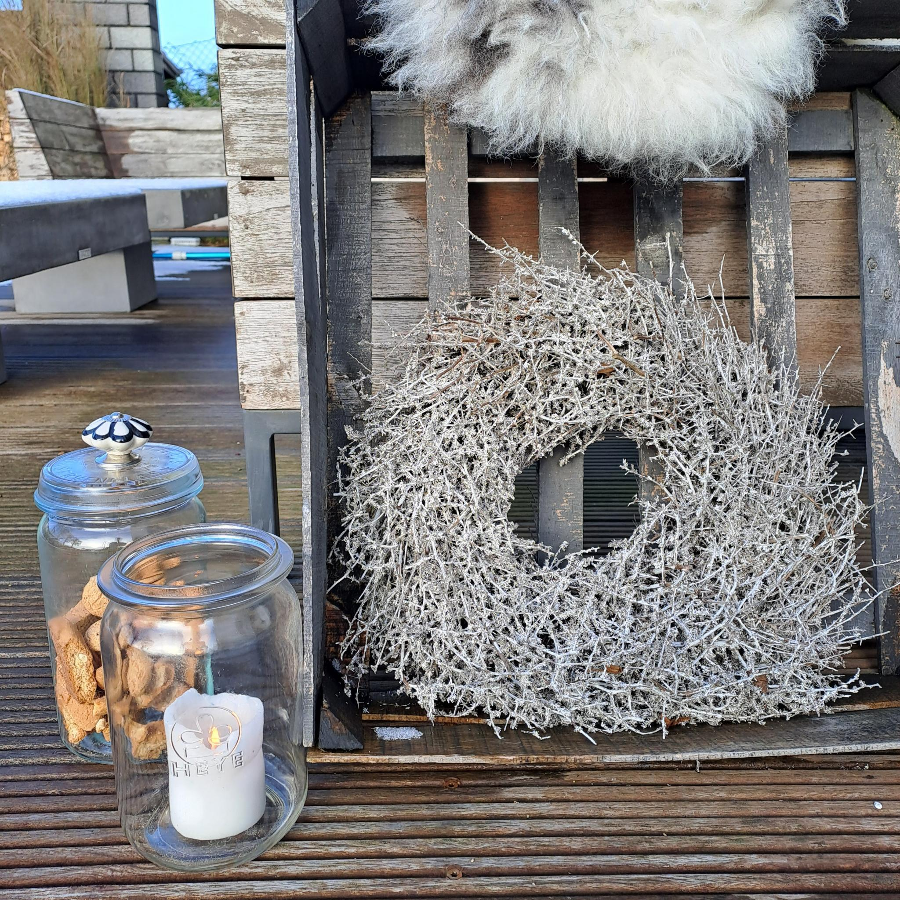

"Kleiner, grüner Kranz, bring uns deinen Glanz.
Mach die Herzen weit, denn mit dir warten wir auf die Weihnachtszeit.
(Rolf Zuckowski)

Kränze gehören für mich in die Adventszeit wie der Schnee zum Winter. Mit ihnen zieht die Vorfreude aufs große Fest zu Hause ein. In den Wochen vor Weihnachten ist der Adventskranz unser Mittelpunkt für ein kostbares Ritual: Jeden Sonntag im Advent wird eine neue Kerze angezündet. Die symbolische Zunahme des Lichts als Erwartung der Geburt Jesu Christi - im christlichen Glauben als "Licht der Welt" bezeichnet.

1839 erfindet der deutsche Theologe und Erzieher Johann H. Wichern den Adventskranz. Um dem Nachwuchs im Hamburger Rauhen Haus, einer Einrichtung für arme Kinder in der Hansestadt, das Warten auf den Heiligabend zu erleichtern, baute er aus einem alten Wagenrad einen Holzkranz. Er bestückte ihn mit so vielen Kerzen wie Tage bis zum großen Tag verblieben. Jeden Tag wurde eine Kerze angezündet, jeden Sonntag eine besonders große.

Heute schaffen sich etwa 80 % der Haushalte im deutschsprachigen Mitteleuropa in der Vorweihnachtszeit einen Adventskranz an. Traditionsbewusste setzen auf drei violette und eine rosafarbene für den vierten Sonntag als Symbol der Vorfreude. Als größter, hängender Adventskranz der Welt wird der im österreichischen Mariazell beworben: 12 Meter Durchmesser & 6 Tonnen schwer.

Beim klassischen Adventskranz aus Kindertagen denke ich an Tannengrün und vier dicke, rote Kerzen. Geblieben ist heute jedoch oftmals lediglich die Anzahl der Kerzen, VIER. Für Designer oder Kreative zu Haus ergeben sich unendlich viele Gestaltungsvarianten. Und tatsächlich muss es nicht immer ein Kranz sein, um eine runde Sache zu werden. Jeder vierarmige Kerzenständer kann als Adventskranz herhalten. "KUBUS" von by Lassen oder "HEIMA" von Norman Copenhagen dienen in der Weltjahresbestzeit als Adventskranz und sind nach den Feiertagen wieder ganz normale Kerzenständer.

In diesem Jahr sind noch immer warme Naturtöne und zarte Pastellfarben wie Eisblau im Trend. Keine anderen Farben strahlen mehr Gelassenheit und Ruhe aus. Tolle Alternativen zu Tanne & Kiefer sind Eukalyptus und Sukkulenten. Gewachst. Trockengräser, Holz, Federn... ergänzen den Look und eignen sich für alle, die es zurückhaltend und stilvoll mögen. Pudrige Rosatöne erinnern an Zuckerguss und Plätzchenduft. Und selbst, wenn die Wände frühlingshaft & sommerlich schimmern, wirken sie mit Waldgrün & frischem Orange erstaunlich modern. Schwer gefragt sind noch immer Schwarz und Grau. Festlich sind Kombinationen mit Rauchglas in Grün- oder Braunnuancen. Schimmernde Akzente ganz ohne Glitzer - früher war mehr Lametta! Puristische Weihnachten.

Basteln, Backen, Singen "Kleiner, grüner Kranz, bring uns deinen Glanz."
Überall im Haus. Auf Tischen & an Türen. Stehend & hängend. Drinnen & draußen.
"Mach die Herzen weit, denn mit dir warten wir auf die Weihnachtszeit."

Freu dich auf einen Adventskalender mit vielen wunderschönen Kränzen. Freu dich auf Ideen & Inspirationen, dein Zuhause weihnachtlich zu verzaubern. Finde mehr und folge mir auf Instagram oder Facebook unter "nicolehoelting_studio".

Von Herzen wünsche ich dir und deinen Lieben eine gemütliche Adventszeit & gesegnete, glanzvolle Festtage! Merry XMAS!

