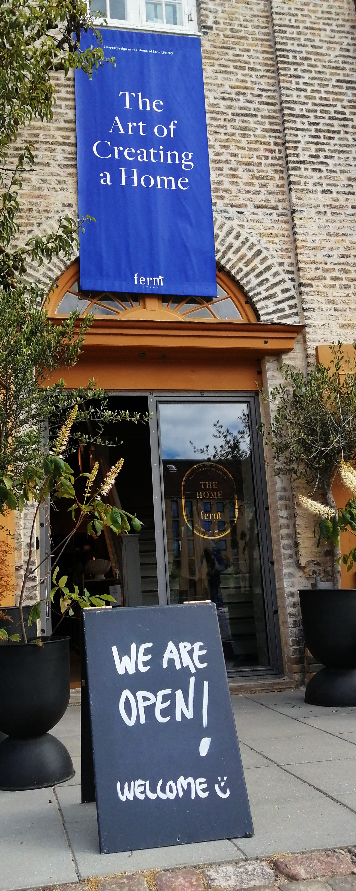

Zu Fuss, per Fahrrad oder mit dem Boot - in Kopenhagen ist
Shopping immer ein ganz besonderes Erlebnis!

Mit knapp 600.000 Einwohnern auf einer Gesamtausdehnung, die
einem Zehntel der von Berlin entspricht, überzeugt die
kleine Insel-Metropole nicht nur als Hauptstadt Dänemarks,
dem ältesten Königreich der Welt, sondern auch als Paradies
für alle Fans skandinavischen Designs.

Architekten schwärmen von Kopenhagen als ein Zentrum
atemberaubender Gegenwartsarchitektur. Mehrfach preisgekrönt
und vom Architekturbüro Henning Larsen konzipiert, ist die
Königliche Oper auf der Insel Holmen eine der modernsten
Bühnen der Welt.

Auch von vielen anderen architektonischen Meisterwerken und
Projekten lasse ich mich bei meinem Besuch in Kopenhagen
inspirieren, vor allem aber genieße ich kleine "Butiken" &
Flohmärkte, Royality, köstliche "Kanelsnegle"
(Zimtschnecken) und live all die fabelhaften Adressen, die ich sonst nur aus
meinen geliebten Wohnzeitschriften und Interiormagazinen
kenne..

Auf ca. 3.000 qm wird hier Licht! Beim dänischen
Beleuchtungshersteller kannst du sowohl neue als auch
bekannte Designklassiker erleben & einen Einblick in Louis
Poulsens langjährige Arbeit gewinnen. Nicht nur die
weltbekannte PH-Lampe von Poul Henningsen wird hier in allen
Farben, Formen & Größen präsentiert. (Gammel Strand 28)

Besteck, Schmuck, Uhren, Schalen, Leuchter - der Bildhauer
Georg Jensen hat Maßstäbe gesetzt. Viele sprechen von ihm
als den größten Silberschmied der vergangenen drei
Jahrhunderte. Im Obergeschoss zeigt ein kleines Museum
(Eintritt frei) die Anfänge seiner Arbeit. (Amagertorv 4,
Konkens Nytorv)

Im Flagshipstore stellt die 1775 gegründete
Porzellanmanufaktur Royal Copenhagen ihr Tafelgeschirr aus -
traditionsreich und doch modern. Auch Schalen, Vasen,
Kerzenständer der ältesten Glasbläserei Dänemarks finden
dort in Regalen Platz, da Holmegaard selbst leider nur noch
als Shop im Shop, auch im Illums Bollighus, unterwegs ist.
(Amagertorv 6, Kongens Nytorv; 2. Wahl Royal Copenhagen gibt
es im Factory Outlet: Soendre Fasanvej 9)

Das Kaufhaus "Illums Bollighus" ist eine Institution. Auf
vier Etagen findest du alles rund ums Wohnen, was das
Liebhaberherz dänischen Designs begehrt: Möbel, Leuchten,
Porzellan, Keramik, Glas & Silber.. (Amagertorv 10, Kongens
Nytorv)

Cirkelbroen - architektonisches Kunstwerk, das verbindet!
Vom isländischen Künstler Olafur Eliasson entworfen, schlägt
sie Fußgängern eine Brücke über den Christianshavn Kanal
Richtung Applebys Plads. Drei der fünf an weißen Masten
aufgehängten Plattformen lassen sich horizontal drehen und
machen somit auch großen Schiffen Platz.

Ferm Living entwirft in seinem Stammsitz in Kopenhagen
Kollektionen von Möbeln, Leuchten & Accessoires in klassisch
dänischem Design. In der Zusammenarbeit mit Handwerkern
weltweit vereint es Skandinavien mit Fertigkeiten &
Traditionen der ganzen Welt. (Kuglegardsvej 1,5)

Was wäre Kopenhagen ohne den Genuss eines typischen
Smörrebröds? Stärkung beim Schaufensterbummel findest du in
den zwei Markthallen "Torvehallerne". An mehr als 60
Verkaufsständen gibt es gehobene Zutaten für das Kochen zu
Hause - Gewürze, Öle, Kaffee, Gemüse, Fisch.. Ich bin jedoch
faul & entscheide mich für ein klassisches Smörrebröd mit
"Smorstegt fiskefilet med remoulade, dild, kapers og
citron". Mh...lecker! (Frederiksborggade 21)

Das in dritter Generation geführte Möbelunternehmen ist
seinem Prinzip treu geblieben, dänische Design-Klassiker zu
bewahren und gleichzeitig seine Kollektion durch neue
Designer zu erweitern.

Purismus, klare Linien, ruhige Farbschemas - ich habe die
Eindrücke in mir aufgesogen! Design & Lifestyle. Kopenhagen
bietet die besten Adressen, um Klassikern zu begegnen, aber
auch um Newcomer zu entdecken. Es zeigt Visionen des 21.
Jahrhunderts genauso wie Historie. Hübsche Cafés &
Restaurants, Straßenkünstler & Feuerschlucker, Souvenirs &
stilvolles Design. Kopenhagen hat mich geflashed, mich
begeistert! Eine absolut lebens- und liebenswerte Stadt!
Überall spürt man im Miteinander, dass die Dänen als die
glücklichsten Menschen der Welt gelten.

Übersetzt heißt "Kobenhavn" - Kaufmanns Hafen. In diesem
Sinne lasse ich dir gern einige Links zukommen, um bequem
von zu Haus aus einen Schaufensterbummel durch die dänischen
Stores machen zu können. Möchtest du mehr? Schreib mir gern
unter studio@nicolehoelting.de... Kaufrausch Kopenhagen.
Viel Spaß beim Shoppen!

<a href="https://www.brostecopenhagen.com/de/" target="_blank" rel="noopener noreferrer">www.brostecopenhagen.com</a> 
<a href="https://www.normann-copenhagen.com/de-DE" target="_blank" rel="noopener noreferrer" >www.normann-copenhagen.com</a>  
<a href="https://www.bolia.com/de-de/" target="_blank" rel="noopener noreferrer">www.bolia.com</a> 
<a href="https://www.boconcept.com/de-de/" target="_blank" rel="noopener noreferrer" >www.boconcept.com</a>

Finde mehr und folge mir auf
<a href="https://www.instagram.com/nicolehoelting_studio/">Instagram</a> oder Facebook unter "nicolehoelting_studio".
