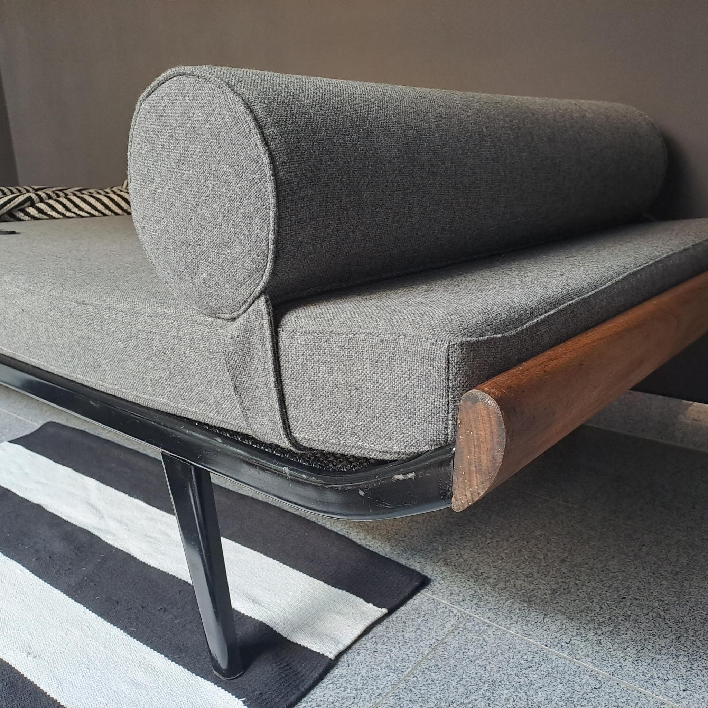
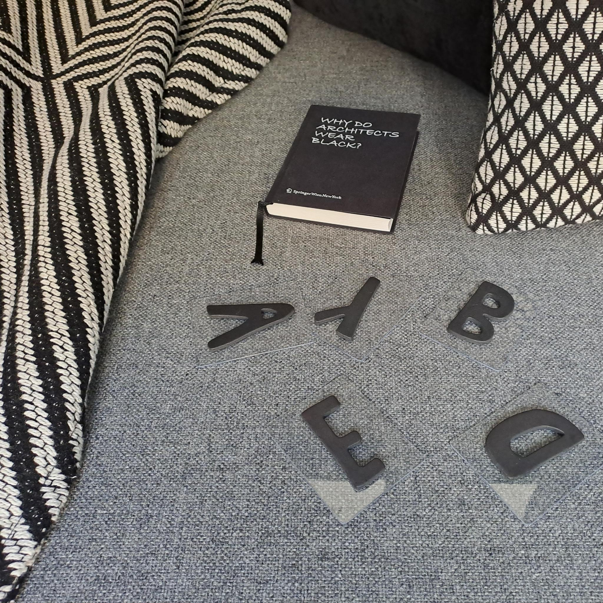
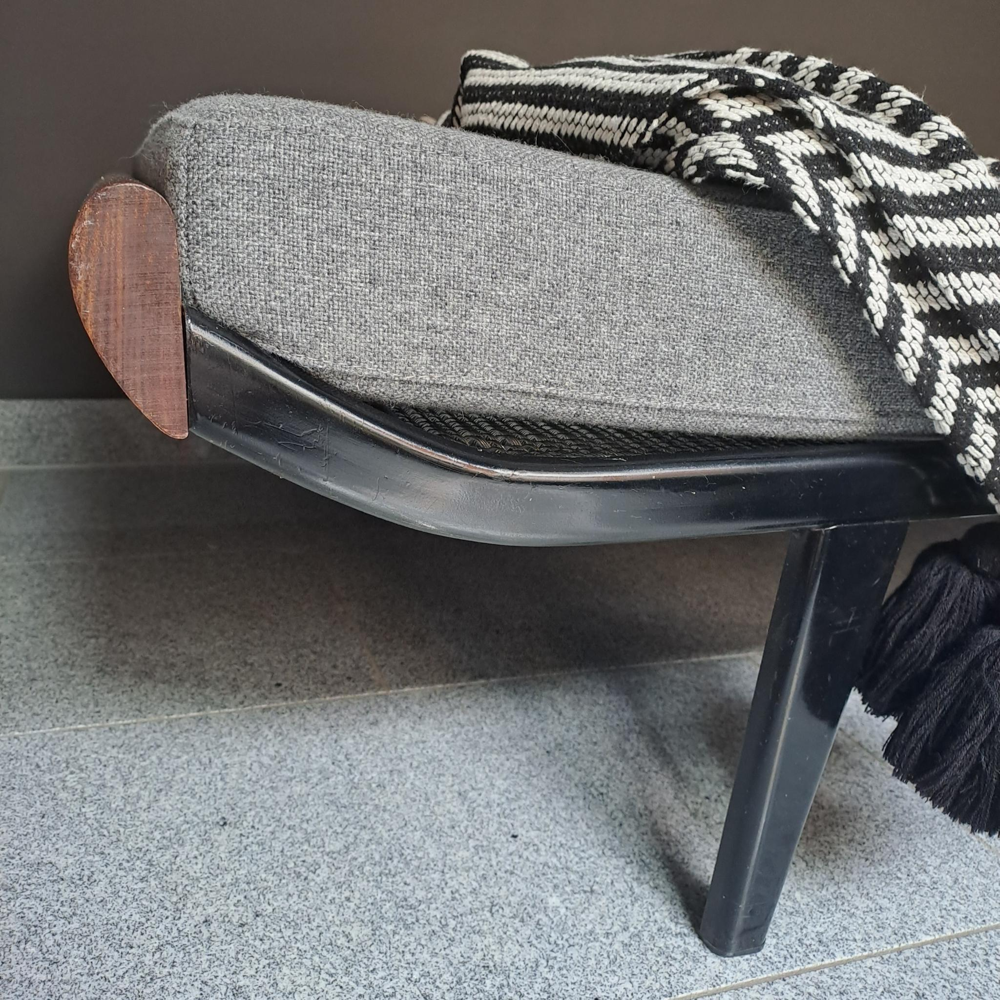
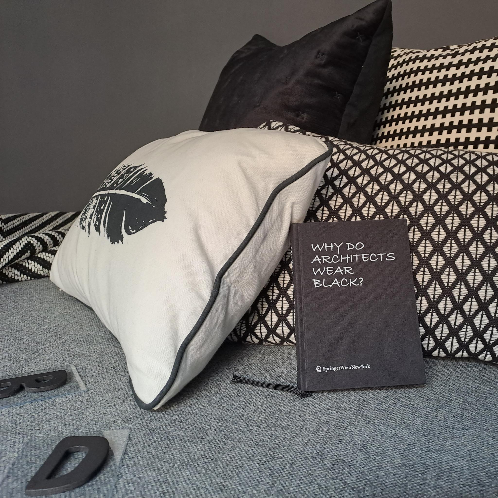

Als berühmtestes Exemplar dieses Möbelstücks gilt allgemein wohl das Daybed "Barcelona", das der Architekt & Möbeldesigner Ludwig Mies van der Rohe im Jahr 1930 entwarf.\
Wie der Name bereits verrät, ist ein Daybed als Schlafmöglichkeit für den Tag konzipiert. Es lässt sich weder als Bett noch als Sofa einordnen. Es bietet einen Liegeplatz für den Mittagsschlaf oder einfach zum Entspannen & Füßehochlegen. Auch andere Begriffe wie Récamiere, Ottomane oder Liege werden oftmals als Synonym verwendet. Als ältester Vorgänger kam das Chaiselongue in der zweiten Hälfte des 19. Jahrhunderts in Frankreich in Mode. Wörtlich übersetzt bedeutet Chaiselongue "langer Stuhl" & so bezeichnet es ein gepolstertes Liegemöbel, das sich durch ein erhöhtes Kopfende vom Bett unterscheidet. Hieraus entwickelte sich wiederum das Récamiere, ein Sofa ohne Rückenlehne, jedoch mit hoch geschwungenen Armlehnen.

Ein Daybed ist vielseitig einsetzbar, multifunktional.
Im Wohnzimmer kann es - je nach Ausstattung - eine zusätzliche Schlafstätte oder Sofaersatz darstellen. Im Gästezimmer bietet es dem Besuch eine Übernachtungsmöglichkeit, den Bewohnern einen perfekten Ort für einen ungestörten Mittagsschlaf oder für eine Lesestunde. Im Garten ersetzen outdoorgeeignete Exemplare die Sonnenliege und laden zum Relaxen ein.

Die kleinen Alleskönner sind in Zeiten von knappem Wohnraum ideal für Menschen, die öfter umziehen müssen & sich somit auf ein Mindestmaß an Gegenständen beschränken möchten. Mittlerweile sind Daybeds in vielen Einrichtungsstilen & für jedes Budget im Angebot.

[www.knoll-int.com](https://www.knoll-int.com/for-home/by-designer/classic-designers/ludwig-mies-van-der-rohe/barcelona-couch)\
[www.auping.com](https://www.auping.com/de/ueber-auping/design/designtradition)\
[www.ikea.com](https://www.ikea.com/de/de/cat/tagesbetten-19046/)

[www.carlhansen.com](https://www.carlhansen.com/de-de/shop-kollektion/sofas-daybeds/ow150/ow150-daybed-oak-soap-hr-re-wool-0108/variant/7711)\
[www.ligne-roset.com](https://www.ligne-roset.com/de/modele/wohnen/sofas/daybed/2215)
