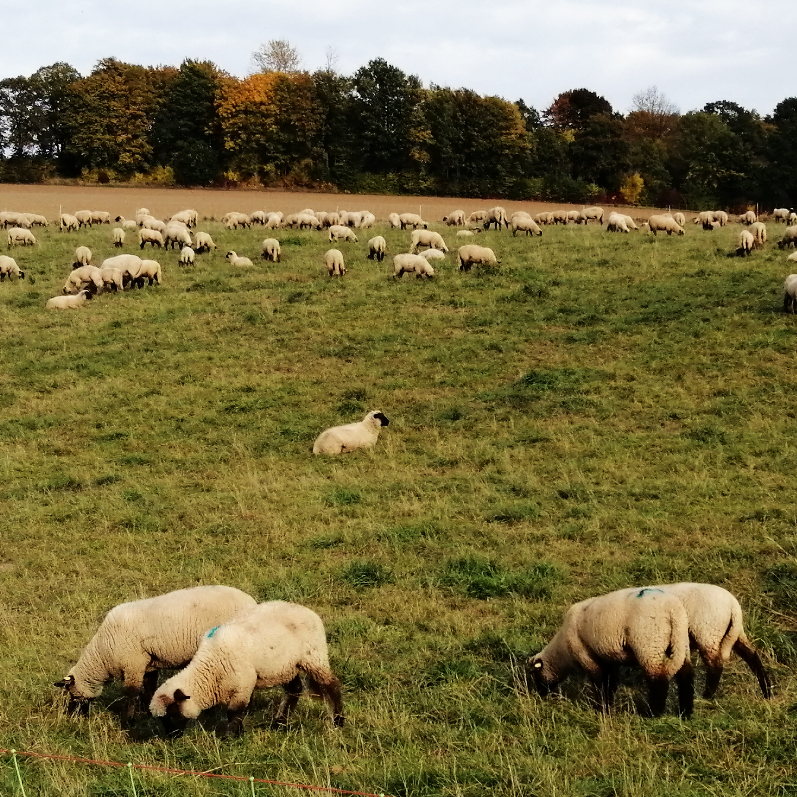
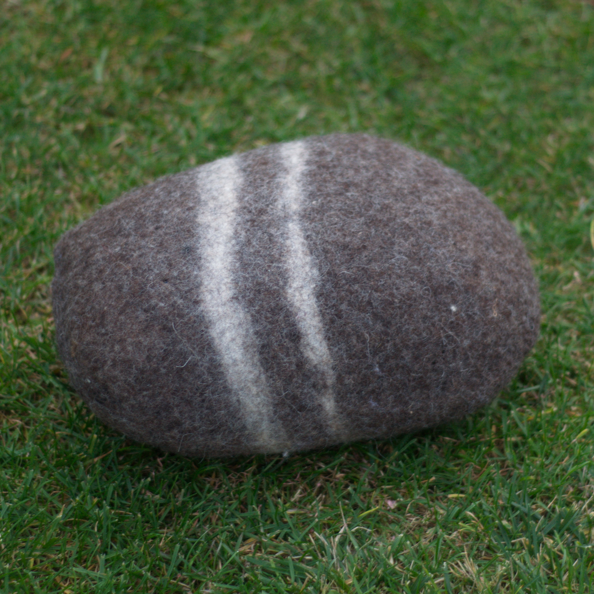
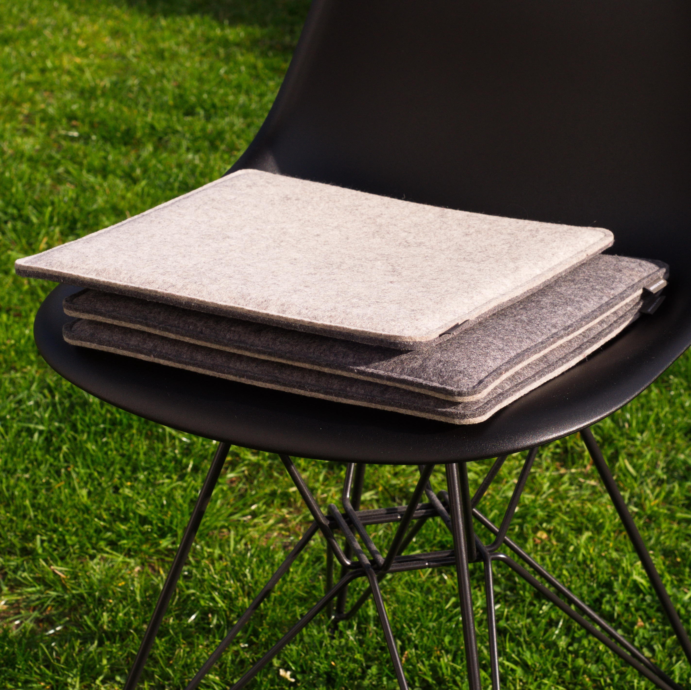
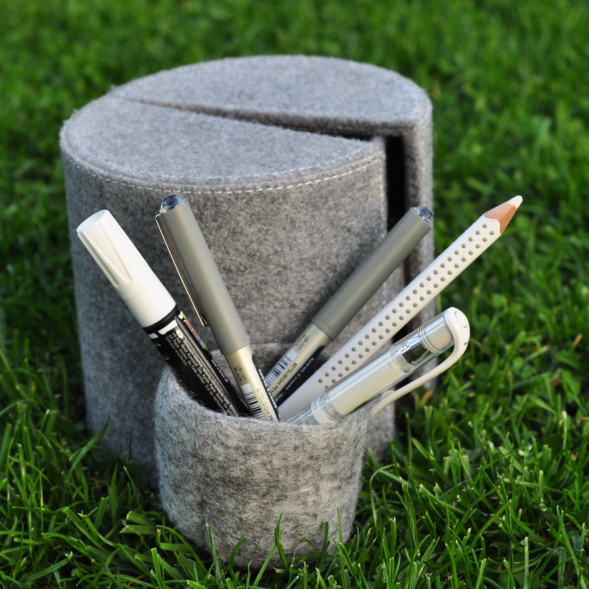
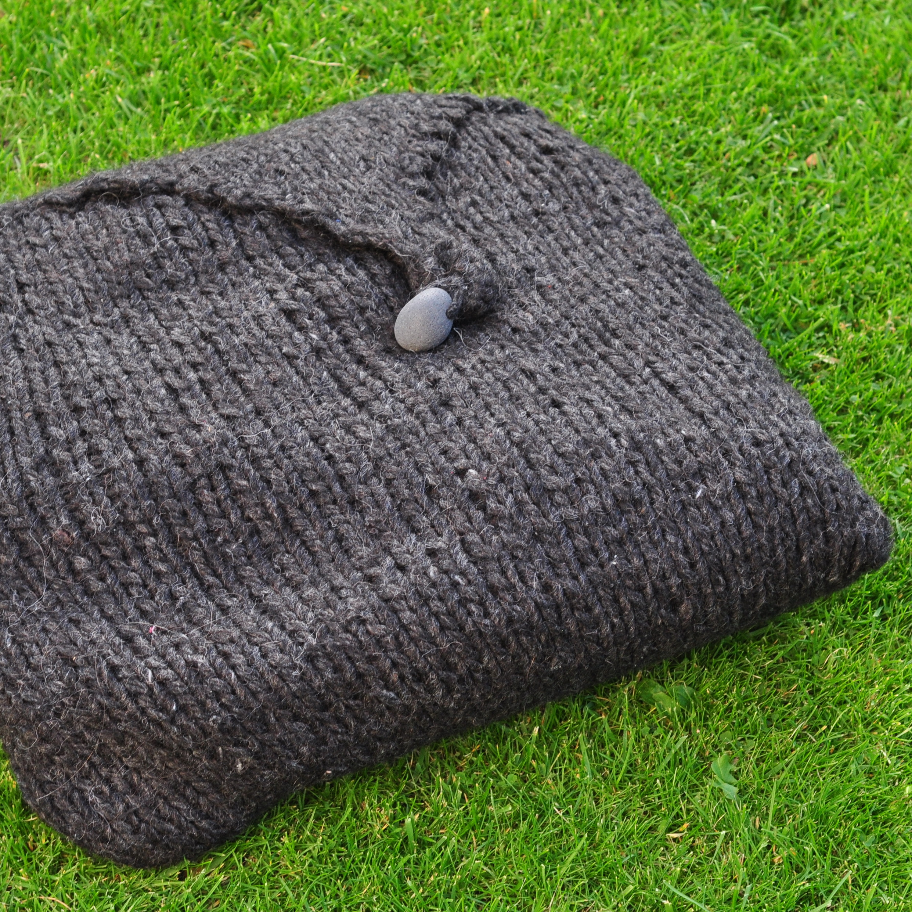
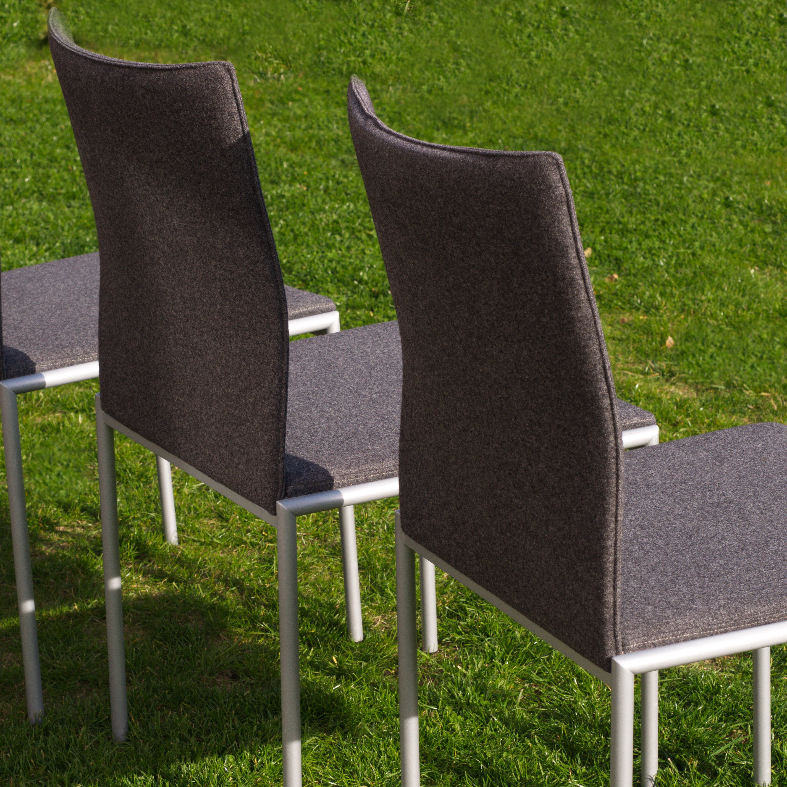
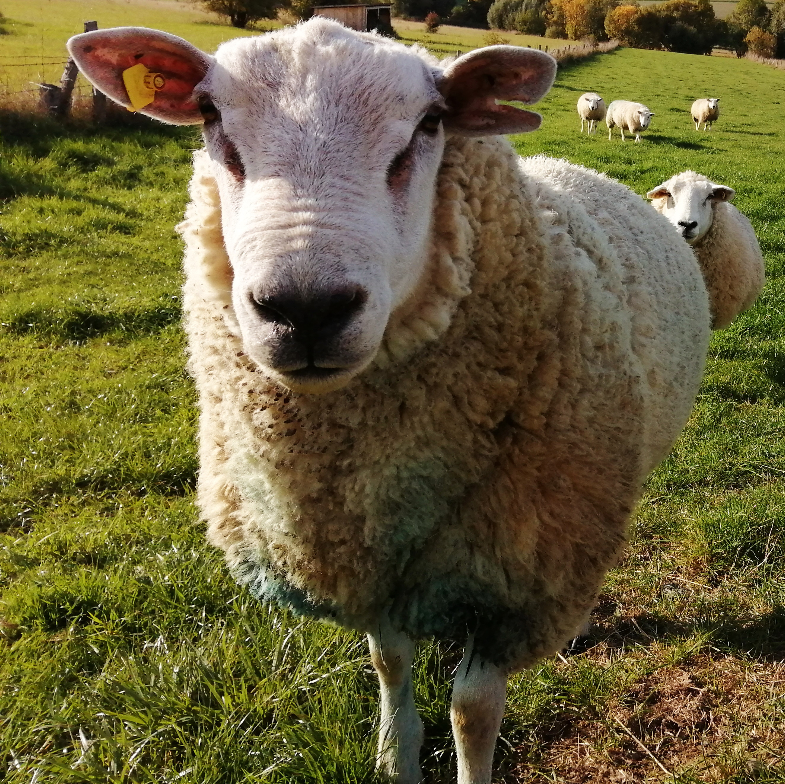
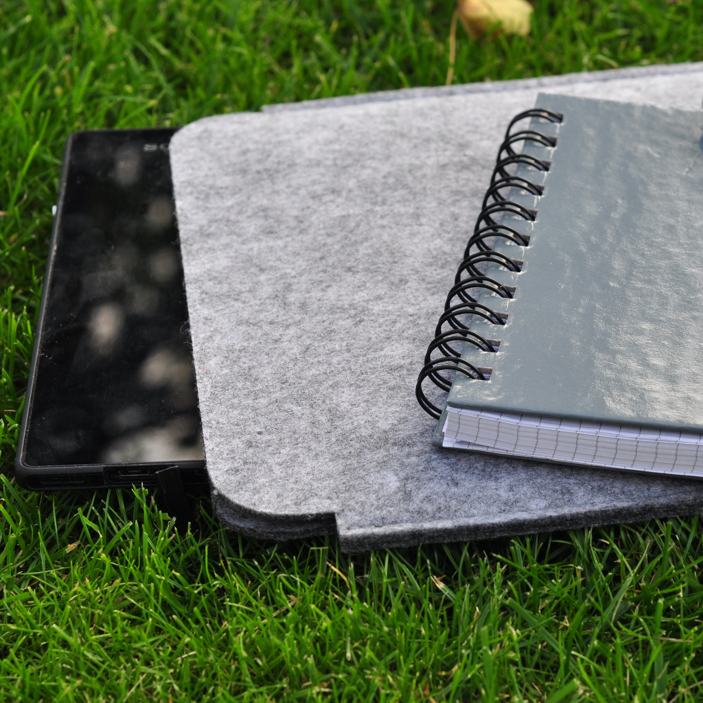
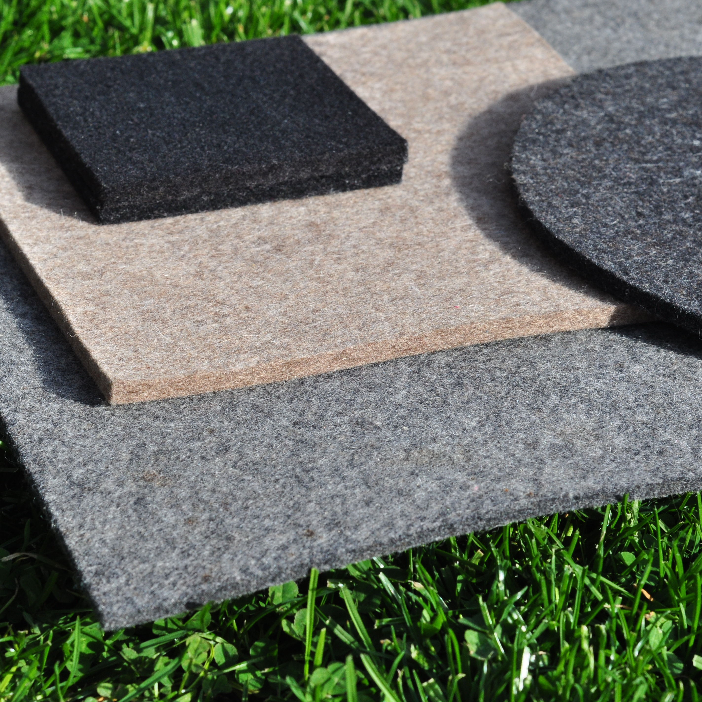

"Was wäre, wenn die bunten Flecken, die zur Erkennung auf das
Schaffell gesprüht werden, nicht abgewaschen werden, sondern im Gewebe
landen?"

Diese Idee liegt der Kollektion "technicolour" zugrunde, die der
Grafikdesigner Peter Saville für die dänische Textilmarke KVADRAT
entworfen hat. Die "ländlichen Graffiti" auf Schafen in Nordwales
haben den Städter aus Manchester dazu inspiriert. Auf den ersten Blick
eintönig fade, gar langweilig, erscheinen die von Saville entworfenen
Möbelstoffe, beim genauen Hinsehen jedoch zeigt sich auf jedem
Quadratzentimeter Stoff ein wahrer Mikrokosmos: Zu dem eigentlichen
Schwarz nimmt man plötzlich Rot, Blau und Gelb wahr. Wie bei der Wolle
der Weidenschafe.. Die Farbmarkierungen auf dem Rücken des
Muttertieres geben dem Züchter Auskunft über Ablammzeit bzw. - quote.

Viele meiner Schaf-Fotos sind in unserem Urlaub in den schottischen
Highlands entstanden. Mir ging das Herz auf, die hübschen Wollknäuel
überall in der Natur zu entdecken: auf höchsten Gipfeln, an Klippen,
auf Wiesen und überall am Wegesrand. Furchtlos. Neugierig. So schön!
Die Inspiration von Saville plötzlich hautnah erlebbar, fühlbar...

Spannend, spaßig beschreibt er die Zusammenarbeit mit Kvadrat, denn
man habe an einer Geschichte gearbeitet. Dies sieht man! Neben der
Unternehmensphilosphie, die mich bei Kvadrat besonders anspricht - sie
zeichnet sich durch Nachhaltigkeit, einen hohen Anspruch an Qualität
und den Respekt vor den Ideen ihrer namhaften Designer aus -, gefällt
mir an der Serie "technicolour" die Ehrlichkeit der Materialien: Ich
liebe die Haptik echter Schurwolle!

Überall in unserem Haus finden sich Objekte aus Filz - quadratisch
oder rund, groß oder klein, farbig oder neutral... als Sitzkissen, als
Stuhl, als Plaid, als Wärmflaschenhülle, als Kieselstein, als
Aufbewahrungskorb, als Utensilo, als Platzsets oder als Teppich...
 
Vielleicht findest ja auch du ein neues Lieblingsstück!

<a href="https://www.kvadrat.dk/en" target="_blank" rel="noopener noreferrer" >www.kvadrat.dk</a>
 
<a href="https://hey-sign.de" target="_blank" rel="noopener noreferrer" >www.hey-sign.de</a>
 
<a href="http://www.myfelt.de" target="_blank" rel="noopener noreferrer" >www.myfelt.de</a>

Und noch ein nicht ganz ernst zu nehmender Tipp:  
Stöbern macht besonders viel Spaß zu Musik von "Wolle" Petry, Ed
"Sheeran" oder zum Song "You spin me round"...

