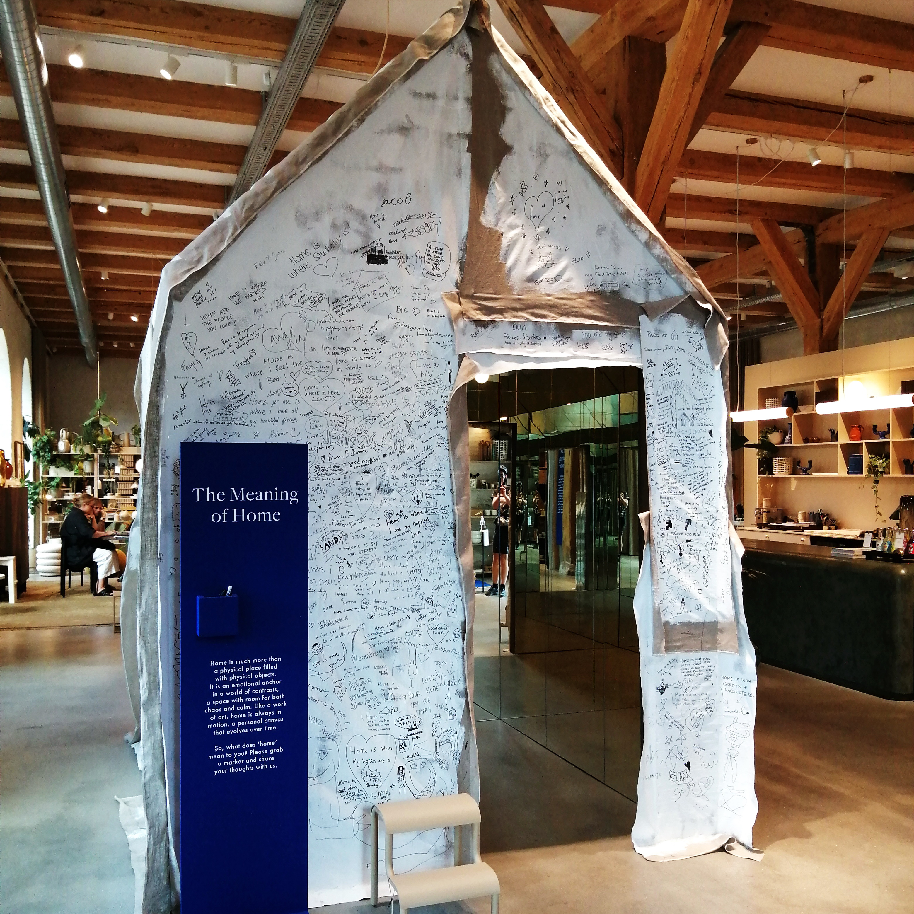
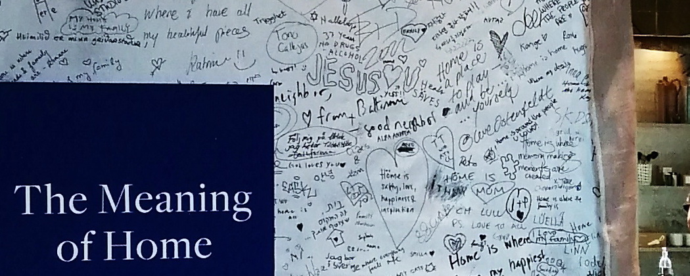
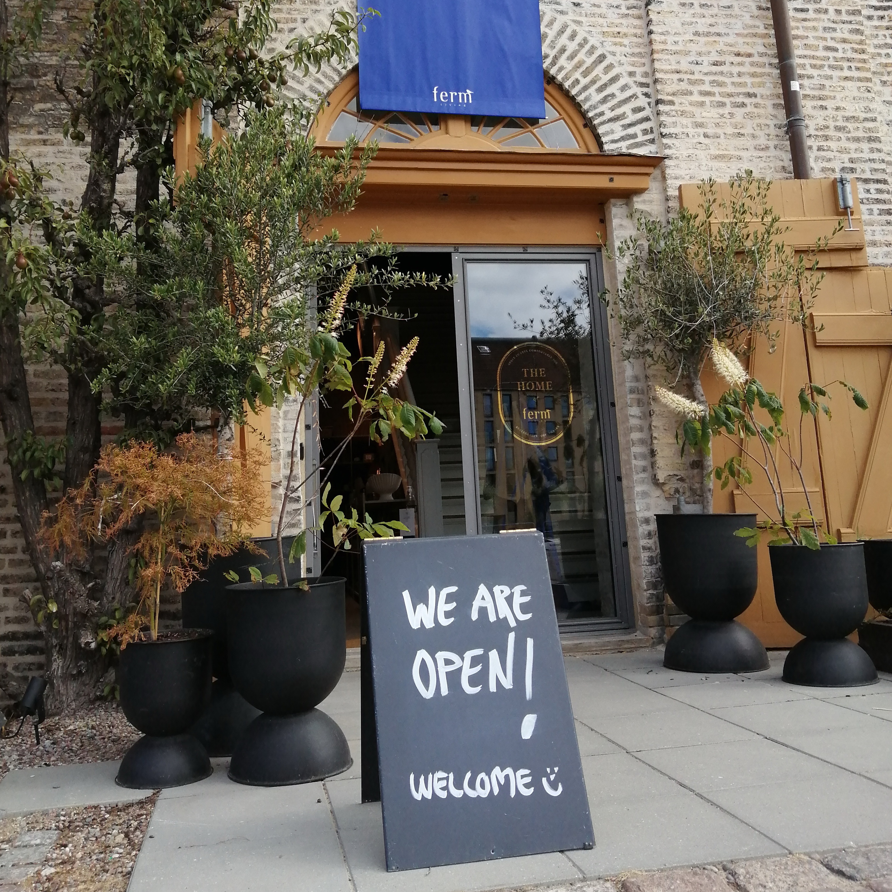
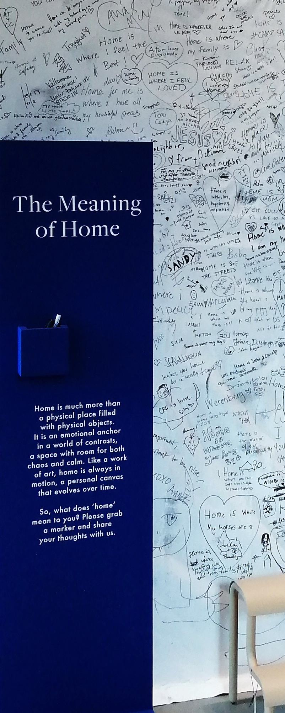

Mit einem "Haus im Haus" überraschte mich der Conceptstore ferm in Kopenhagen und stellte die Frage "What does 'home' mean to you?" Neben dem Haus: Stifte, eine Trittleiter und die klare Aufforderung, seine persönliche Auffassung von HOME zu verewigen. Spontan habe ich geschrieben: 
 
"ZUHAUSE bedeutet 'offene Arme'!"

Denn offene Arme symbolisieren für mich alles, was ich mit Zuhause verbinde.
Zuhause ist mein Nest, mein Kokon, in dem ich warm, sicher und geborgen bin.
Zuhause ist mein Sicherheitsnetz, das mich hält, mich stützt, wenn ich falle.
Zuhause ist Zuhören & Verstandenwerden.
Zuhause kann ich sein, wie ich bin und wer ich bin.
Zuhause ist mein Lebensmittelpunkt, der wichtigste Ort der Welt!

What does HOME mean to you?  Was bedeutet ZUHAUSE für dich? 
Schreib mir gern!  Ich bin gespannt auf deine Antwort, freu' mich.

