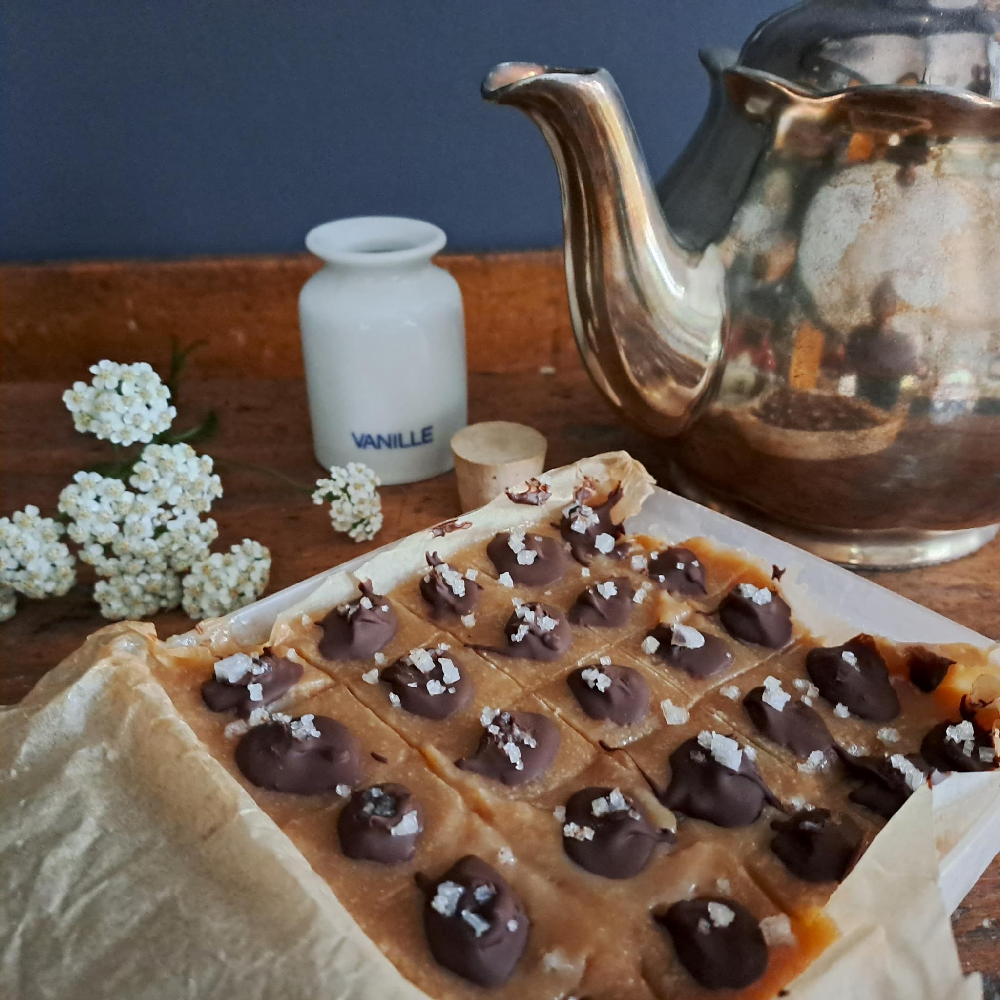
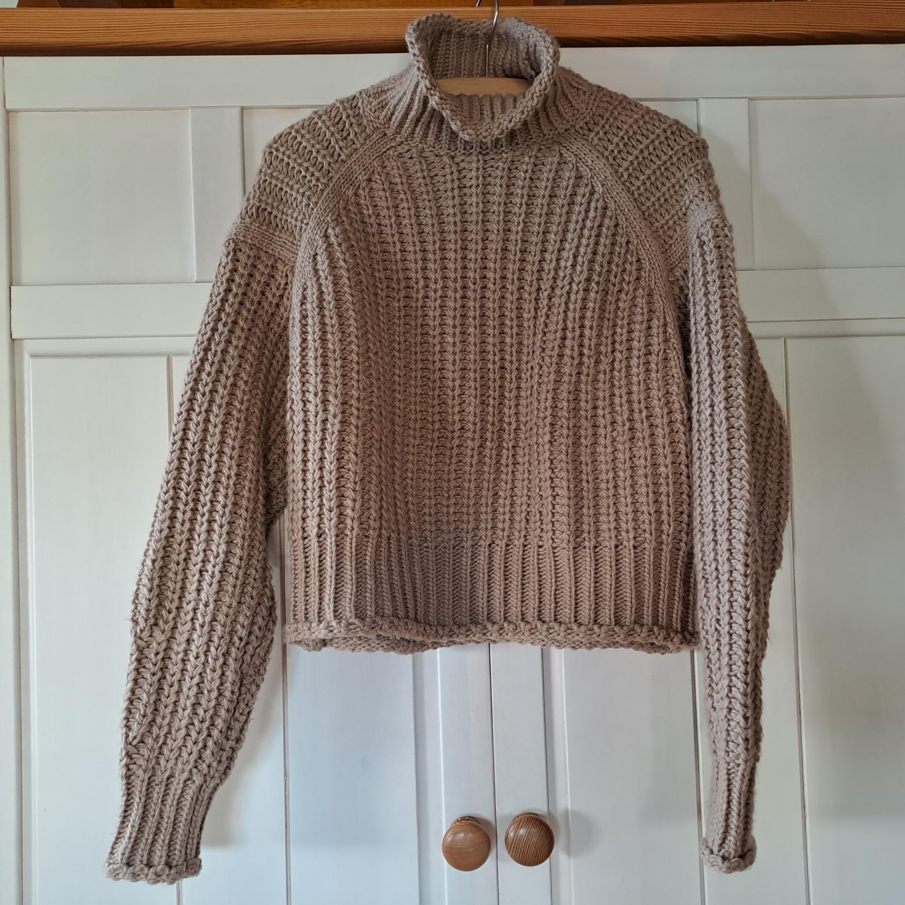

Ach, wäre das Leben doch voller MILCHSCHAUM-SKULPTUREN...
Meinen Latte Macchiato liebe ich über alles!
Er kann nämlich viele wunderbare Dinge:\
 mir HALT geben, wenn meine Hände das Glas ganz fest umschließen...\
 mich von der Arbeit ABLENKEN: im Büro, im Garten, zu Haus und überall dort, wo ich gerade stecke, großartig!\
 meine NEUGIERDE stillen, wenn ich im Straßencafé sitze und heimlich Menschen beobachte...\
 mich wacher machen als jeder WECKER...\
 mich GLÜCKlich machen, weil er sooooooo herrlich duftet...\
 mich beim Schreiben meines BLOGS begleiten, Thema für Thema...\
... und tatsächlich schreibe ich jetzt sogar über MACCHIATO - wie wunderbar!

DENN: Auf den "3 days of design" in Kopenhagen (07. bis 09. Juni 2023) oder auf der Mailänder Möbelmesse (18. bis 23. April 2023) - Räume in den Farben von Coffee & Toffee begegnen uns bei vielen Marken wie &Tradition, Cor oder Cassina. Natürlich bin auch ich in Sachen INTERIORDESIGN sofort auf den Geschmack gekommen! Denn diese Wandfarbe strahlt Geborgenheit & Wärme aus, fühlt sich an wie eine wohltuende Umarmung.

Für jeden Raum geeignet, entfaltet ein warmer MACCHIATO-Ton jedoch erst an lichten Wänden seine volle Wirkung. Und selbst ein kräftiger Karamellton ist keineswegs aufdringlich. In Kombination mit Holz, Créme, Grau und Akzenten in Schwarz verliert er seine Dominanz, schaffst du ein entspanntes Ambiente. Halte bei Holzmöbeln oder -türen Farbmuster vertikal daneben und achte darauf, dass die Nuancen miteinander harmonieren, sich aber in der Helligkeit unterscheiden. Auch zu Parkett oder Dielen sehen Wände in Toffee klasse aus! Mein Tipp: Grenze beide Flächen mit weißen Fußleisten voneinander ab. Vielleicht hast du aber einen grauen Fußboden aus Beton oder Fliesen. Dann wirst du schnell feststellen, dass das Raumgefühl unglaublich an Gemütlichkeit gewinnen wird, wenn du Wände in warmem Braun gestaltest. Dekoriere mit Textilien, die diesen Ton wieder aufgreifen, z.B im Bad mit Handtüchern von JOOP, auf dem Küchenstuhl das Kissen "Nordic Kit" von Marc o Polo in der Farbe "Toffee" oder auf dem Sofa "Free-Cushion - Sugar Kelp" von Ferm Living. Der Teppich "Ethan Cook Flat Works Brown" von HAY wirkt ebenfalls wohltuend warm. Geflochtene Leuchtenschirme oder Pflanzgefäße runden die Wohnlichkeit ab.

Mutige mixen die KARAMELLfarben aber auch gern mit kräftigen Tönen wie Bordeaux, Dunkelgrün, Himmel-, Tauben- oder Dunkelblau. Farbige Tischleuchten setzen zu Wänden & Möbel stilvolle Akzente und sind irgendwann bei Nichtgefallen ebenso schnell ausgewechselt wie Plaids & Kissen. Die Leuchte "Flowerpot" von &Tradition gibt es in vielen bunten Farben. Toll finde ich sie zu TOFFEE in dunkelrot. Im Bettüberwurf "Pavilion" - völlig krass - kombiniert Hübsch Interior MACCHIATO sogar mit Rosa, Lila, Grün, Hellblau & Gelb.

Egal, was du anstrebst: Zauberhafte Namen von Wandfarben machen direkt beim Kauf Lust auf die Veränderungen zu Hause. "Everybody loves Nuts". "Paper Bag". "Macchiato". "Elegante Gelassenheit". "My Toffee". Herrlich!

Mein Tipp: Koch dir einen leckeren Cappuccino, lass dich von meinen Ideen inspirieren. Schneide Fotos in deinen Wunschfarben aus Zeitschriften, sammle Stoffreste, Hölzer & lege zusammen mit verschiedenen Accessoires dein persönliches Moodboard. So wirst du schnell und doch entspannt herausfinden, wie mutig du bist, welche Kombinationen dir gefallen, dir guttun.

Fühlst du dich dennoch unsicher, helfe ich dir selbstverständlich gern bei den Entscheidungen, begleite & berate ich dich bei Einkäufen, erstelle Shoppinglisten. Und/oder falls gewünscht, unterstütze ich auch bei der Koordination von Handwerkern. Raumdesign z.B. zum fairen m2-Preis! Nutze den unverbindlichen Kennenlern-Call oder schreibe mir eine Mail unter studio@nicolehoelting.de.

Möchtest du mehr "Kaffee-Geschichten" lesen? Dann schau doch gern unter www.loeffelweise-glueck.de und probiere die leckeren [Rezeptideen #kaffee](https://loeffelweise-glueck.de/rezepte/?search=%23kaffee) ....

