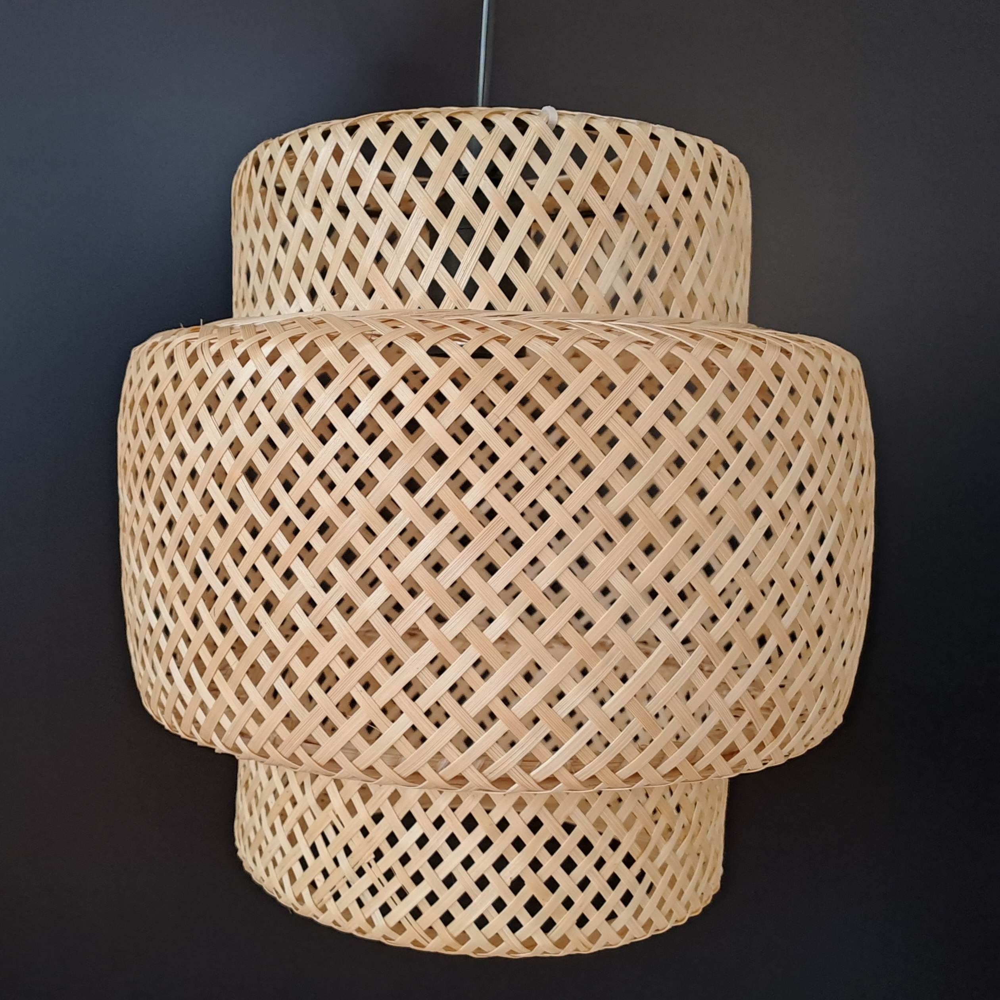
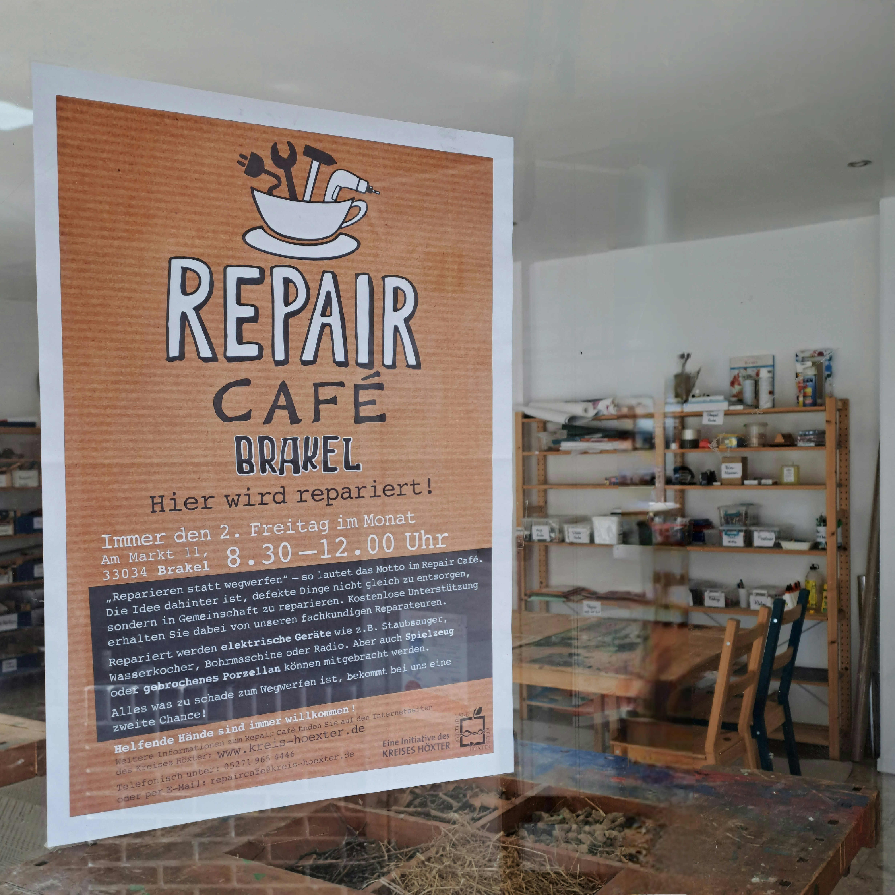
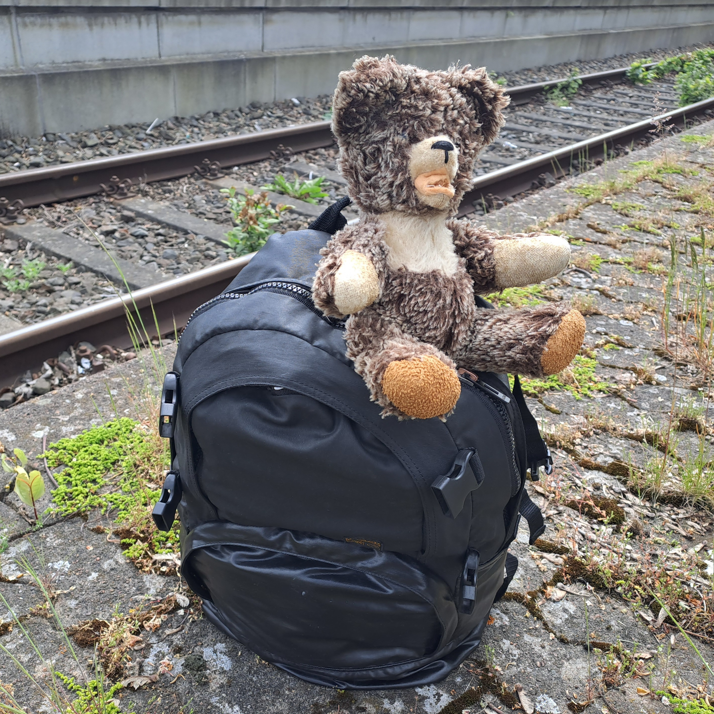

Heute. Morgen. Und übermorgen.  
Nicht nur die Vergangenheit bestimmt unsere Zukunft, auch
unsere Entscheidungen im Hier und Jetzt. Klimawandel,
Ressourcenknappheit und der Verlust an Biodiversität gehören
zu den drängendsten Herausforderungen unserer Zeit. Unser
Planet ist endlich.  
Bereits seit dem 04. Mai haben wir in Deutschland unser
Jahreskonto an nachhaltig nutzbaren Ressourcen überzogen.
Der World Earth Overshoot Day 2023 ist vom Global Footprint
Network für den 02. August berechnet. Die Tendenz ist
traurig: 1971 - 20. Dezember, 1980 - 04. November, 1990 - 11. Oktober, 2000 - 23. September, 2010 - 07. August!

Grund genug, sich an dieser Stelle unbedingt auch in Sachen
EINRICHTEN über das Thema NACHHALTIGKEIT Gedanken zu machen.
Wohnen, wohlfühlen mit Weitsicht. Langlebigkeit als
Lebensmodell. Verantwortlich planen & kaufen.  
Müllvermeidung fängt bei Verzicht an. Alles, was nicht
hergestellt wird, muss am Ende nicht entsorgt werden,
benötigt für beide Vorgänge keine Energie. Gerade in der
letzten Zeit versuche ich, Spontankäufe zu vermeiden, mir
bewusst über meine Ansprüche & Bedürfnisse im Klaren zu
werden. Was brauche ich wirklich? Die britische Designerin
Ilse Crawford - auf dem Foto ihre Lampe SINNERLIG - hat
einmal gesagt: "Das Problem ist nicht, dass wir konsumieren.
Das Problem ist, dass wir die Dinge, die wir kaufen, nicht
genug lieben."

Ein schöner Designklassiker, handwerklich hochwertig
gearbeitet, wird nicht verschrottet, sondern vererbt.
Funktional zeitloses Design wird vermutlich niemals aus der
Mode kommen. Konsumieren wir hochwertige Qualität, sind die
Möbel langlebig und vielseitig einsetzbar: Stühle können
drinnen wie draußen stehen, ein Hocker funktioniert als
Beistelltisch oder Tritt, ein Sofa als Gästebett und ein
Trolley als Hausbar oder Homeoffice-Hilfe. Variable
Möbelsysteme passen sich veränderten Lebens- und
Wohnsituationen an. Unsere modulare Regalwand von HÜLSTA
z.B. stand vor 27 Jahren im Wohnzimmer, danach im Esszimmer,
Arbeitszimmer & aktuell präsentieren wir in ihr unsere
schönsten schwarzen Schuhe auf dem Flur.

Auch Dinge, die man reparieren kann, gibt es wieder - und in
vielen Städten neue "Repair-Cafés". Zweite Hand wird zur
ersten Wahl! Ob in Online-Shops oder im Einzelhandel. Marken
wie Vitra etablieren Circle-Stores, Dornbracht recrafted
Armaturen & mehr. Viele Unternehmen, z.B. Skagerak und Artek
haben ihr Angebot um die Rücknahme gut erhaltener,
gebrauchter Waren erweitert, bieten ihren Kunden diese in
Fundgruben erneut zum Kauf an. "Zweite Chance" heißt das
Konzept bei IKEA. Für diesen Blog habe ich es live getestet
und bin begeistert.  
<a href="https://www.ikea.com/de/de/customer-service/services/buy-back/" target="_blank" rel="noopener noreferrer">www.ikea.com/de/de/customer-service/services/buy-back/</a>  
<a href="https://www.dornbracht-recrafted.shop/" target="_blank" rel="noopener noreferrer">www.dornbracht-recrafted.shop/</a>

Tatsächlich war diese positive Erfahrung der Startschuss für
viel mehr! Nach und nach kramten wir unzählige Kleinmöbel
aus dem Keller, die vor etlichen Jahren dorthin verbannt
wurden. Wir verschenkten sie über Kleinanzeigen oder
stellten sie mit einem "ZU-VERSCHENKEN-SCHILD" an die
Straße. Ein Irrglaube, dass wir sie vielleicht irgendwie
irgendwo irgendwann noch einmal verwenden würden. Es
befreit. Sooooo vielen lieben Menschen bereiteten wir
scheinbar eine große Freude - sie bedankten sich mit
Schokolade, lila Herzen, selbstgemachter Marmelade...  
 
Den Gebrauchtwaren-Trend finde ich ebenfalls bei Bauherren,
die ihr Traumhaus zwar neu errichten, vielfach jedoch auf
gebrauchte Materialien setzen - Ziegel, Hölzer, Fliesen,
Türen... Ihre Entscheidungen treffen sie allerdings nicht
ausschließlich aus Gründen der Nachhaltigkeit. Denn alte
Herstellungsverfahren bieten darüberhinaus vielfach einen
Mehrwert, z.B. als Wärmespeicher. Ganz zu schweigen von der
fulminanten Ästhetik: die oftmals interessante Patina
vermittelt Charakter & Wertigkeit. Bezugsquellen und Infos
findest du online z.B. unter  
<a href="https://www.ziegelkontor.de" target="_blank" rel="noopener noreferrer">www.ziegelkontor.de</a>
 
<a href="https://www.historische-baustoffe.de" target="_blank" rel="noopener noreferrer">www.historische-baustoffe.de</a>

Ebenso wie wir bei dem Transport von Lebensmitteln auf den
biologischen Fußabdruck schauen, sollten wir dies auch bei
Baustoffen & Möbeln tun. Oftmals fertigen Unternehmen, die
in Europa oder im Hochlohnland Deutschland produzieren, ihre
Waren unter anspruchsvollen Umwelt- und Sozialstandards. Der
Blick auf die Gütesiegel lohnt. Holz aus nachhaltiger,
zertifizierter und regionaler Forstwirtschaft erfreut die
Ökobilanz ebenso wie umweltgerechte Öle, Wachse & Leime.
Beispiele findest du hier:  
<a href="https://www.e15.com" target="_blank" rel="noopener noreferrer">www.e15.com</a>  
<a href="https://www.team7-home.com" target="_blank" rel="noopener noreferrer">www.team7-home.com</a>
 
<a href="https://shop.zeitraum-moebel.de" target="_blank" rel="noopener noreferrer">www.shop.zeitraum-moebel.de</a>
 
<a href="https://www.grueneerde.com" target="_blank" rel="noopener noreferrer">www.grueneerde.com</a>

Ein ökologisches Möbelstück kann außerdem auch aus
nachwachsenden oder recycelten Materialien bestehen, die
sich am Ende sortenrein voneinander trennen lassen. Höchste
Ingenieurskunst erfordert z.B. die Entwicklung
kreislauffähiger Stahlemaille für die Badewanne "Oyo Duo"
von Kaldewei. Und der Duschkopf "Pulsify Planet" von Hans
Grohe besteht zum Großteil aus Kunsstoffrezyklat. Stühle aus
einem Guss, auch das ist nachhaltig:  
<a href="https://hay.dk/news/hay-in-the-world-2022/elementaire-chair" target="_blank" rel="noopener noreferrer">www.hay.dk/news/hay-in-the-world-...</a>
 
<a href="https://www.muuto.com/products/shop-by-family/fiber-chair-family/" target="_blank" rel="noopener noreferrer" >www.muuto.com/products/shop-by-fam...</a>
 
<a href="https://www.magisdesign.com/de/product/bell-chair/?codice=AT&showprice=&codiva=20&valuta=EUR&stato=Austria" target="_blank" rel="noopener noreferrer">www.magisdesign.com/de/product/bell-chair/</a>
 
<a href="https://www.vitra.com/de-de/living/product/details/tip-ton?keyword=vitra%20tip%20ton" target="_blank" rel="noopener noreferrer">https://www.vitra.com/de-de/living/product/...</a>

Zauberhaft, die "Lieblingsvasen" - und so vieles mehr - der
Berliner Künstlerin Lisa Mathieu aus 100 % Altglas...  
<a href="https://the-way-up.de/pages/lieblingsvasen" target="_blank" rel="noopener noreferrer">www.the-way-up.de/pages/lieblingsvasen</a>

Ökobilanz statt Wegwerfgesellschaft. Umweltzone im eigenen
Zuhause - zuversichtlich, zukunftsfähig.  
Heute. Morgen. Und übermorgen.  
Was brauchen wir wirklich?  
Ist weniger nicht vielleicht doch mehr?

"Als ich mich auf den Weg machte, die Welt zu retten" - in
seinem Buch nimmt uns Martin Häusler mit auf eine Reise in
die Nachhaltigkeit.  
<a href="https://scorpio-verlag.de/Buecher/523/AlsichmichaufdenWegmachtedieErdezuretten.html" target="_blank" rel="noopener noreferrer">www.scorpio-verlag.de/Buecher/523/Alsichmich...</a>

Silbermond formuliert es musikalisch:
<a href="https://youtu.be/ohHJjPSsW8c" target="_blank" rel="noopener noreferrer">https://youtu.be/ohHJjPSsW8c</a>

Finde mehr und folge mir auf
<a href="https://www.instagram.com/nicolehoelting_studio/" target="_blank" rel="noopener noreferrer">Instagram</a>
oder Facebook unter "nicolehoelting_studio".
