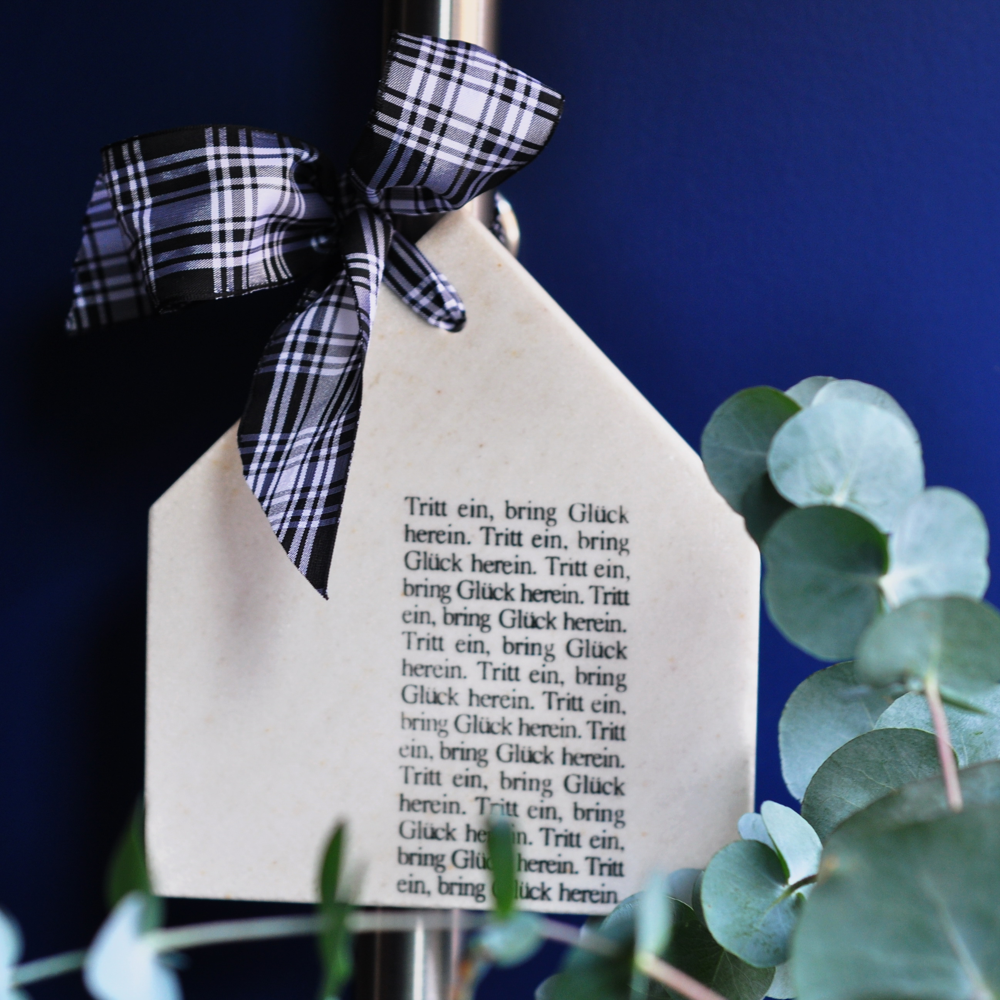
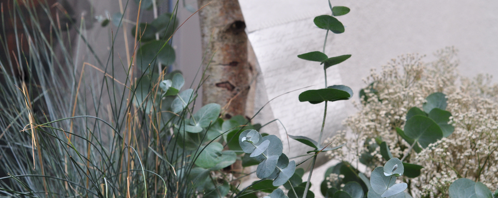
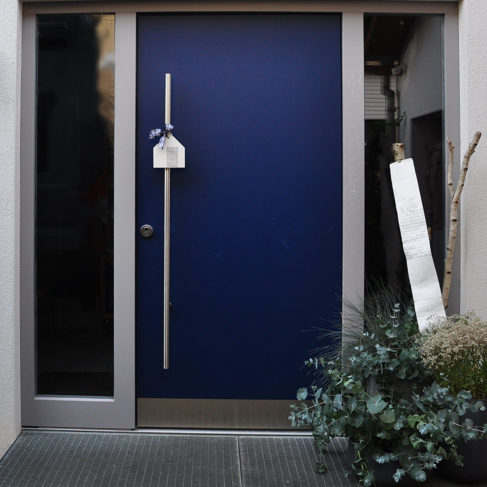

Hast du dich schon einmal gefragt, wie viel Licht du brauchst? Fühlst du dich in großen, hellen Räumen mit viel Platz für Ideen & Gedanken wohl oder bevorzugst du kleine Zimmer mit noch kleineren Fenstern, die dir ein beschützendes und sicheres Nest sind? Bei welcher Farbe kannst du entspannen, bei welcher konzentriert arbeiten? Welche Form soll dein Sofa haben, welches Material dein Schreibtisch?
Ich möchte dich inspirieren, über dich und dein Wohnumfeld nachzudenken, denn nicht in jedem Haus sind wir der gleiche Mensch! Diese These stellt Alain de Botton in seinem Buch "Glück und Architektur" auf und beschreibt die Kunst, daheim zu Hause zu sein. Immer dann wenn die Proportionen des Außen mit deinem Innenleben übereinstimmen, wird dich die RAUMgestalt glücklich machen, wirst du fühlen, dass dir der Raum gefällt.

Mein Blog ist eine Einladung, dich in deinem Zuhause zu finden. Trau dich, lass dich ein auf Gedankenspiele, Farbexperimente, Städtereisen.. Schreib mir gern deine Fragen, Anregungen und dein ehrliches Feedback. Vor allen Dingen aber hab Freude & viel Spaß! Willkommen in meinem studio! HEREINSPAZIERT.

