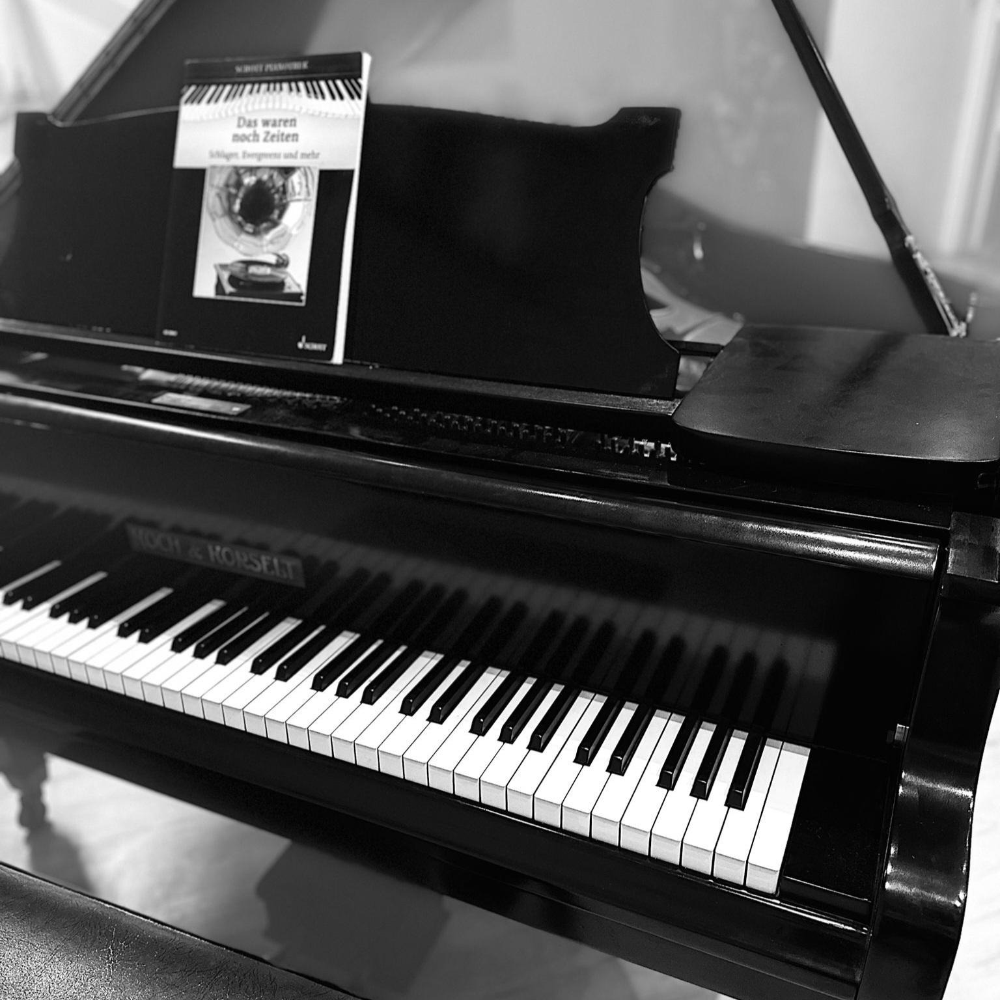
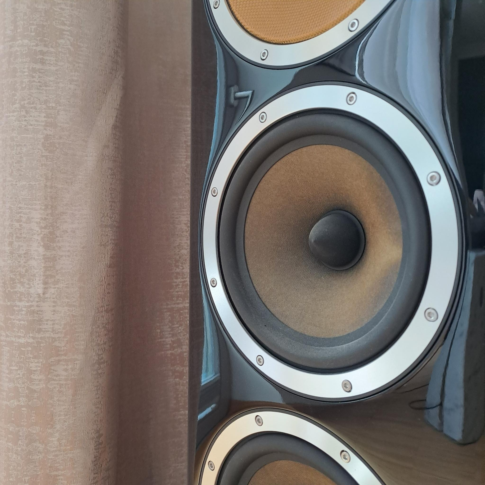
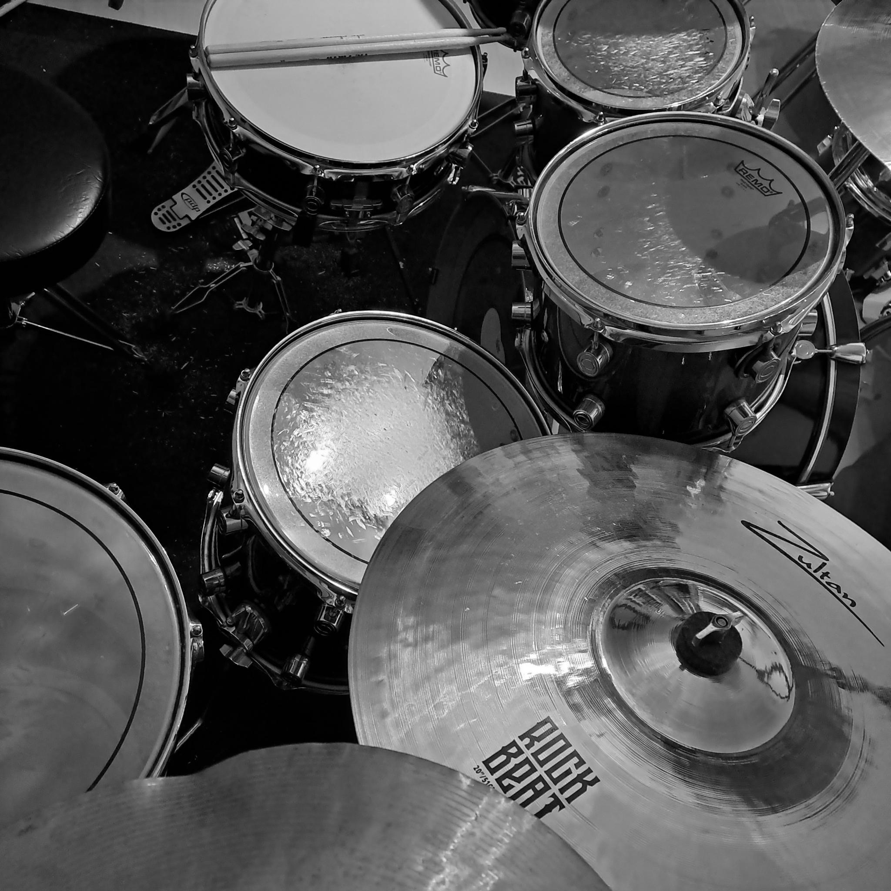
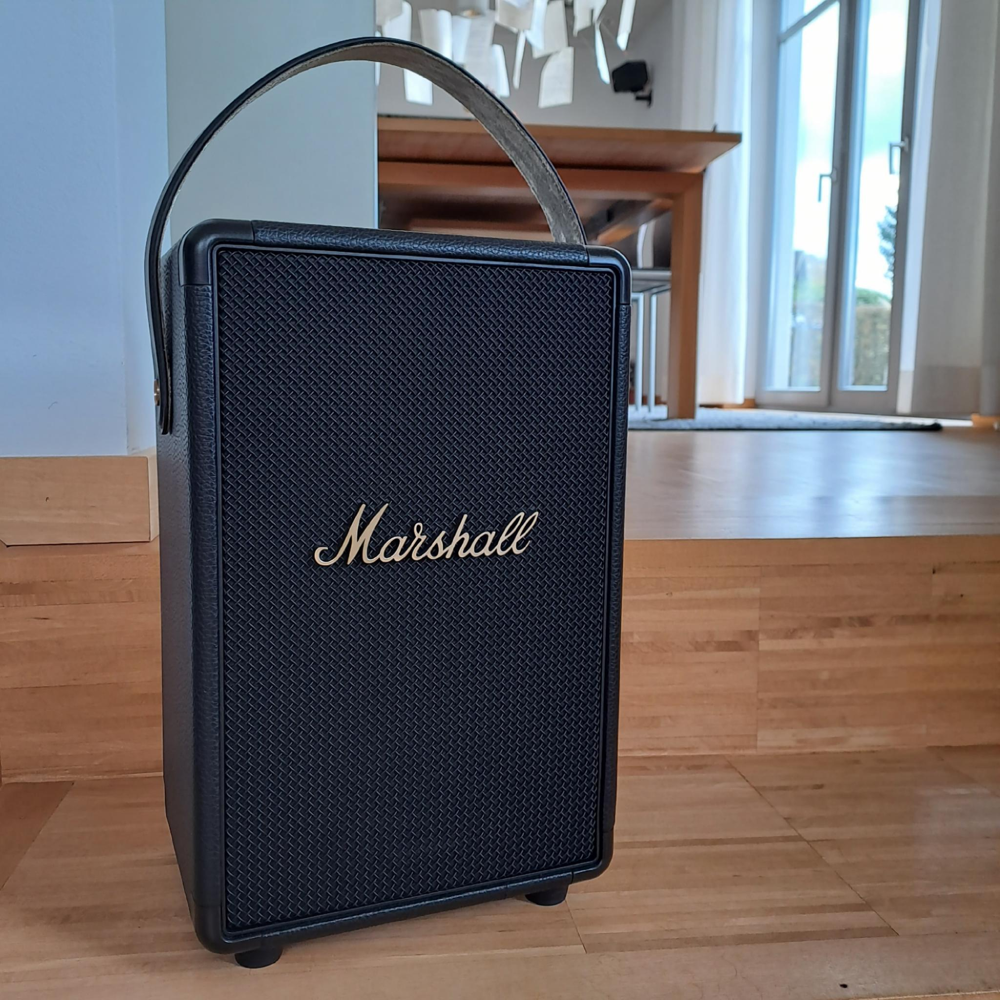
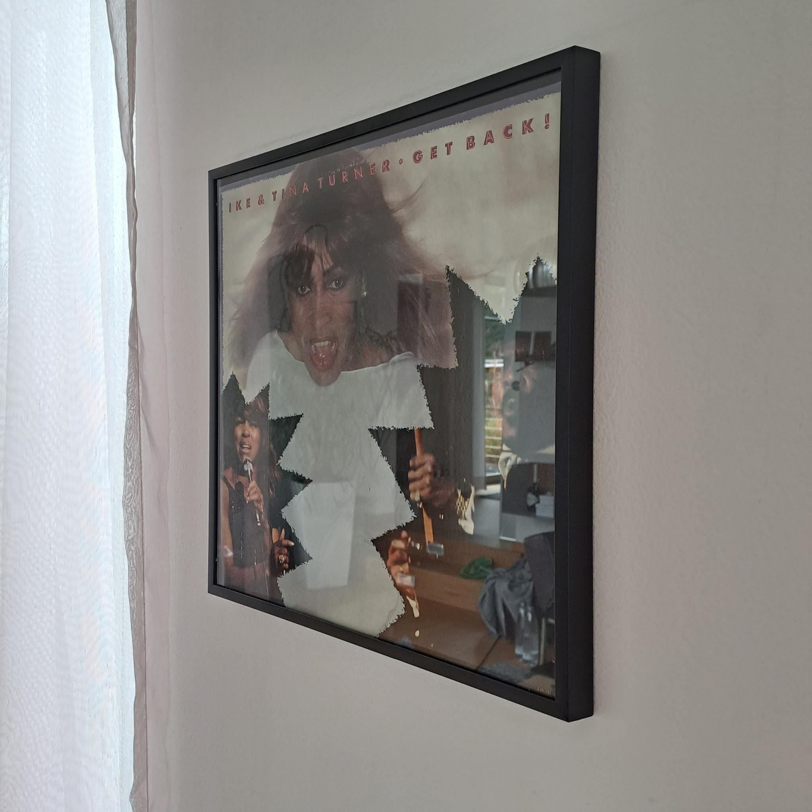
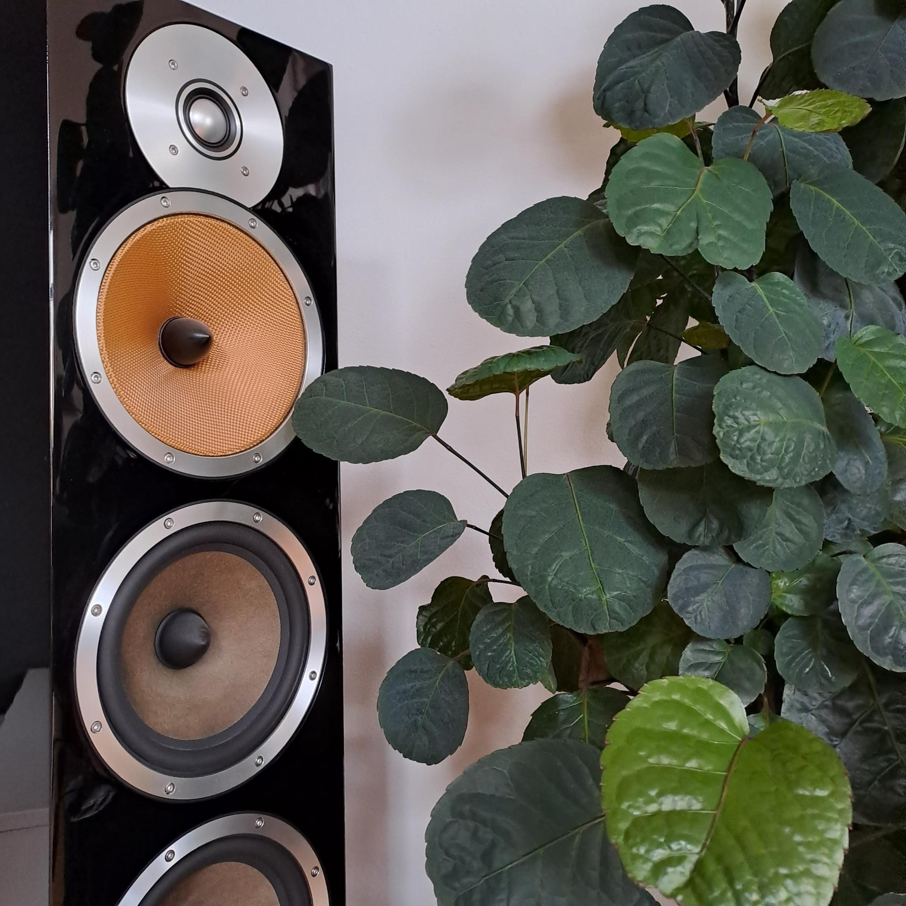
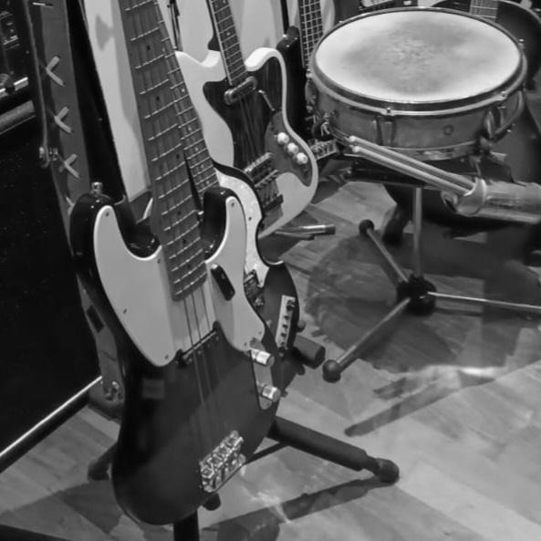
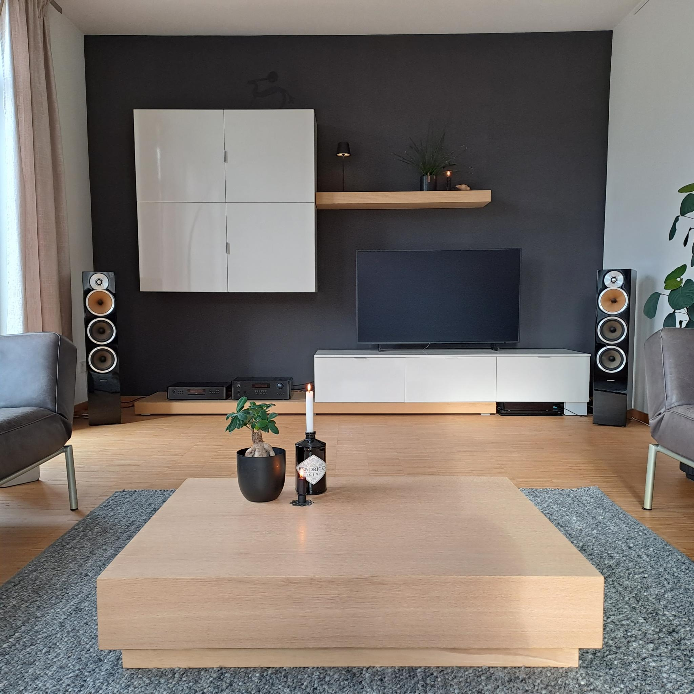

Musik wird oft als Sprache des Gefühls verstanden. Mich trägt sie durch mein Leben!
Sie lässt mich tanzen, wenn ich fröhlich bin und rührt mich zu Tränen bei Traurigkeit. Immer ist sie an meiner Seite.

KLANGFARBE
Fester Bestandteil eines Tons, definiert durch sein Schallspektrum, welches wiederum aus verschiedenen Elementen wie dem Grundton, den Obertönen, sowie verschiedenen Rauschanteilen, dem zeitlichen Verlauf oder auch der Lautstärke zusammengesetzt ist.

ZWISCHENTON
Unterton; eine bewusst oder unbewusst versteckte Mitteilung; indirekter, undeutlicher, relativ vager Hinweis auf etwas; Angedeutetes, Halbgesagtes

So wie sich die Klangfarbe eines Tons aus verschiedenen Elementen zusammensetzt, braucht es auch bei der Einrichtung eines Musikzimmers verschiedene Elemente, um einen gewünschten Klang zu erzeugen - ein Hörerlebnis.
Blickfang oder Understatement? Diese Entscheidung definiert die Zwischentöne.

„Einrichten ist wie ein Orchester zu leiten.“

Wie wichtig ist dir Musik? Wieviel Zeit verbringst du mit ihr? Möchtest du dir ein eigenes Musikzimmer einrichten, um sie in aller Ruhe, mit vollem Genuss hören zu können? Wie designorientiert wünschst du dir die Hi-Fi-Komponenten? Oder soll die Technik vielleicht einfach nur alltagstauglich, vielleicht sogar völlig unauffällig in vorhandenem Wohnraum integriert sein?

Musizierst du selbst? Und wenn ja, möchtest du dein Instrument präsentieren oder es lieber in einem Schrank sicher aufbewahren? Wieviel Platz benötigt dein Flügel? Brauchst du Schallschutz für dein Schlagzeug? Sitzgelegenheiten für Zuhörer?

Fragen über Fragen...

Beginnen wir zunächst mit den ZWISCHENTÖNEN: Mit dem Ansatz "weniger ist besser" verbindet die Marke "Braun" seit 1921 verbrauchsorientierte Produkte mit eindrucksvollem Design. Das "Braun-Atelier" mit seinen audio-Soundsystemen war Ende der 1970er Jahre Vorreiter in der Unterhaltungselektronik, erlebt aktuell eine Renaissance mit seinem kultigen Erbe, räumt namhafte Designpreise ab. Das BEO-Soundsystem - bestimmt kennst du die großen, runden Lautsprecher BEOSOUND A9 auf drei Holzbeinen - des dänischen Herstellers Bang & Olufsen war revolutionär. Auch seine Objekte BEOSOUND SHAPE für die Wand sind ein Hingucker, ein dekoratives Kunstwerk. Nach eigenen Angaben legt B&O bei seinen Produkten im Hochpreissegment großen Wert auf außergewöhnliches Design und leichte Bedienbarkeit. Der deutsche Hersteller "T+A" aus Herford brilliert seit 1978 mit höchsten Ansprüchen an Material, Design & Klang, gewinnt in 2023 erneut einen begehrten Designpreis. Auch viele andere Hersteller haben ebenfalls den Trend zum Design entdeckt. Schlicht & elegant. Reduziert & edel.

Vielleicht findest du bei den nachfolgenden Links die eine oder andere Idee für deinen Weihnachtswunschzettel:

www.braun-audio.com \
www.bang-olufsen.com \
www.ta-hifi.de \
www.rotel.com \
www.bowerswilkins.com \
www.bose.de \
www.loewe.de

Moderne Soundsysteme ermöglichen heute ein raumübergreifendes 360-Grad-KLANGFARBEN-Erlebnis, das Gefühl, inmitten der Musik zu sitzen. Möchtest du Vergleichbares zu weniger Geld, setze auf Akustikpunkte im Raum, die eine "akustische Symmetrie" erzeugen. Beachte dabei den Abstand der Lautsprecher zueinander, aber auch zur nächsten Wand. Die Hersteller empfehlen hier meist ihr eigenes RAUMkonzept mit variierenden Vorgaben.
Große Lautsprecher mit vollem Klangvolumen stehen von der Schallübertragung des Bodens abgekoppelt sicher auf entsprechenden Unterlagen. Schalldämmende Teppiche mindern nicht nur Umgebungsgeräusche, sondern sorgen dank dieser Reduzierung auch für eine deutlich bessere Akustik.

[Schalldämmender Teppich](https://perfectacoustic.de/termek/schalldaemmender-teppich/) \
[Akustik Filzteppich](https://www.akustikkunst.de/produkte/fussboden/akustik-filzteppich.html)

Für lauten Sound oder Kinoeindruck empfiehlt es sich darüberhinaus, über einen Schallschutz an Wänden & Decken nachzudenken. Anregungen findest du hier:

[Hexagon Schallabsorber](https://www.fennext.eu/products/schallabsorber-hexagon-velvet-shades?variant=44125040673033) \
[Schallabsorber](https://www.dpj-workspace.com/de/38-schallabsorber)

Doch auch Textilien - z.B. der Deltacoustic-Vorhang von Creation Baumann - sind in ihrer Wirkung nicht zu unterschätzen. Sie brechen den Schall im RAUM, sorgen nicht nur für eine gute Akustik, sondern auch für Gemütlichkeit. Denn bei aller hervorragender Technik solltest du das Wichtigste nicht vergessen: Um Musik entspannt genießen zu können, benötigst du auch eine entspannte Sitzposition. Setze auf bequeme Möbel - Stuhl, Sessel oder Sofa! Sind sie gepolstert, sorbieren auch sie den Widerhall. Versprühe Wärme wie du magst: Gardinen, Kissen, Plaids...

Und natürlich Pflanzen! Ein jeder weiß, dass sie nicht nur das natürliche RAUMklima verbessern, Staub binden. In einem Musikzimmer absorbieren sie durch ihre strukturelle Oberfläche auch den Schall. Sie sorgen für frische Luft im Zimmer und schützen somit Technik & Instrumente vor dem Einstauben. Ich empfehle, in Musikzimmern auf Dekoelemente zu verzichten. Sie machen regelmäßiges Staubwischen schwieriger, dabei ist Staub der größte Feind der Technik!

Um möglichst viele glatte Flächen zu haben, solltest du ausreichend Stauraum einplanen. Ein funktionierendes Ordnungssystem für Kassetten, CDs, Schallplatten und Technikzubehör ist unabdingbar. Störendes Kabelzubehör verschwindet idealerweise in geschlossenen Elementen. Optische Hingucker, wie die persönliche CD-Sammlung, wird in auf Maß gefertigten, offenen Regalen präsentiert & besondere Platten-Cover kommen hübsch gerahmt an die Wand! Sie setzen Statements, ZWISCHENTÖNE, und dokumentieren deinen persönlichen Stil. Denn egal wie du in der übrigen Wohnung eingerichtet bist - puristisch oder verträumt - auch im Musikzimmer sollte diese Tendenz Anklang finden. Bedenke, dass eine unruhige, "laute" Einrichtung von den eigentlichen KLANGFARBEN ablenkt. Weniger ist ganz bestimmt mehr!

Nutzt du dein Musikzimmer jedoch nicht nur zum Hören schöner Klänge, sondern auch zum Musizieren, wirst du ganz bestimmt selbst am besten wissen, wo dein Instrument zu platzieren ist. Ein Klavier steht gern mit dem "Rücken zur Wand". Ein Flügel wirkt besonders in der Raummitte. Holzinstrumente sind vor Feuchtigkeit, Temperaturschwankungen & Staub zu schützen. Mach dein Zimmer zur Bühne! Genieße. Schwärme in höchsten Tönen. Tanze.

DOCH: In unserem Musikzimmer wird am Samstag, 18. November 2023 UNSERE Technik schweigen. Warum? Weil wir großartigen Besuch erwarten!

Das Duo "2inJOY" wird mit ihrem Hauskonzert all unsere Räume mit Klangfarben schmücken! Unser offenes Zuhause wird zum intimen Konzertsaal.

Mit ihren Eigenkompositionen und gefühlvollen Jazz-Soul-Interpretationen bekannter Pop-Songs haben sich Michael Diehl & Florezelle Amend auch international einen sehr guten Ruf erspielt. Die aus Manila (Philippinen) stammende Florezelle - dort mehrfach preisgekrönt - hat eine erstaunliche Stimme, die mit einem unglaublichen Spektrum an Umfang und Expressivität aufwarten kann. Michael ist ein Fingerstyle-Gitarrist, der eine komplette Begleitung mit Bassgrooves, Akkorden & percussiven Elementen meistert. Seine Gitarre scheint ein komplettes Orchester zu ersetzen. Seit 2005 sind die beiden als Duo "2in Joy" auf den Bühnen der Welt unterwegs - und im November bei uns zu Gast!

www.2injoy.de

Ich bin sehr gespannt, freue mich riesig auf schöne Gespräche, kostbare Momente, auf ganz besondere Klangfarben & Zwischentöne!!!
