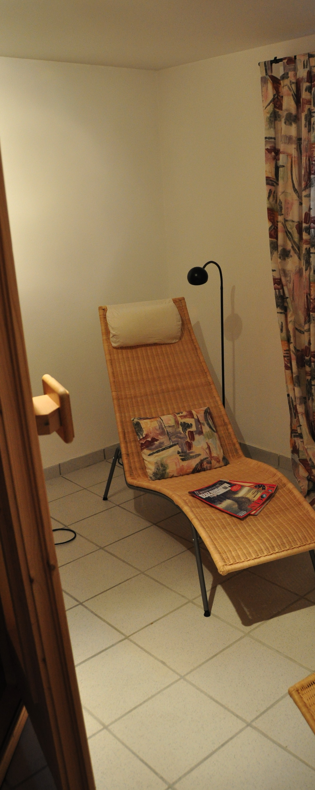
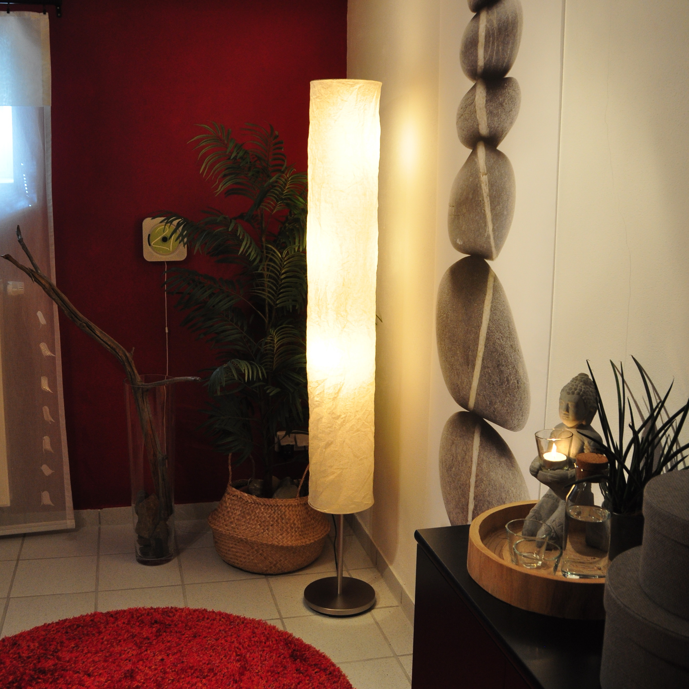
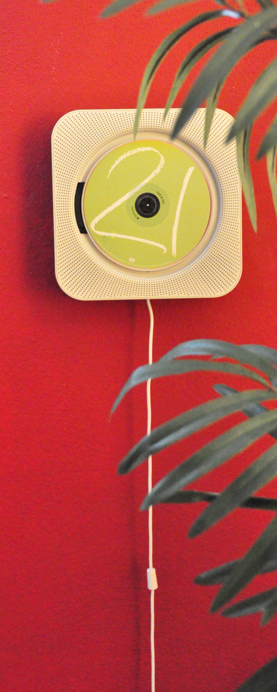
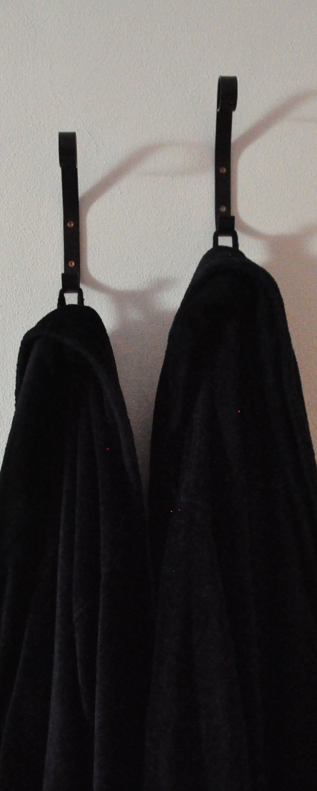
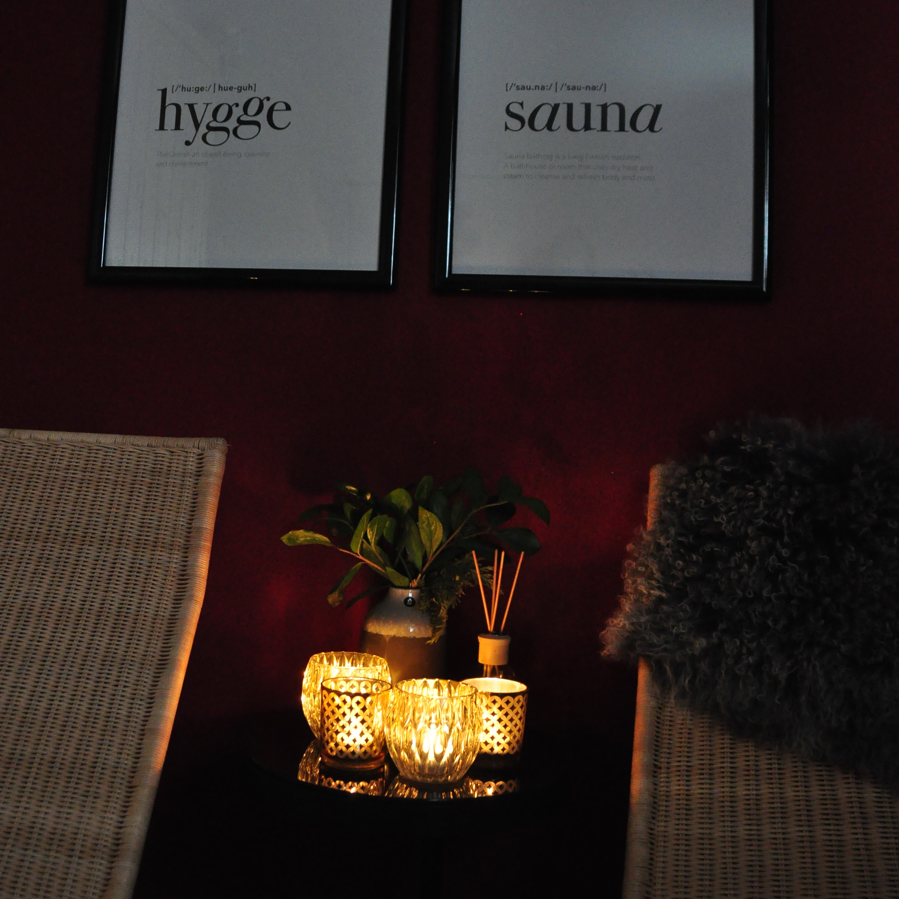
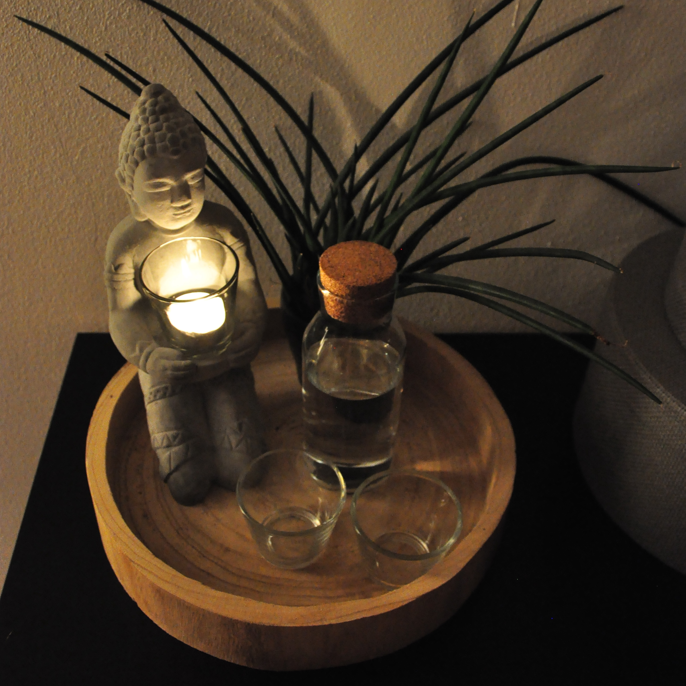

HOMESTORY  
 
Die Aufgabe: 
Die Sauna im Keller wird zwar regelmäßig angeheizt und doch fehlt dem Raum die Wärme...
Weiße Wände, weiße Fliesen und der Blick in den unansehnlichen Lichtschacht verhindern Erholung. 
 
Die Idee: 
Der kühle Kellerraum soll zur Wohlfühloase erhoben werden! 
Zusammen mit dem Fichtenholz der Sauna gibt tiefes Rot der Schwedenhäuser dem Raum nun hyggelige
Atmosphäre und Gemütlichkeit. Fundstücke vom letzten Skandinavien-Trip, 
indirekte Lichtquellen, Kerzen & Duftstäbchen, ein flauschiger Teppich, Plissées & Gardinen, Bücher
zum Lesen und Loungemusik vom wandmontierten CD-Player laden zum Verweilen und Entspannen ein...
Urlaub im eigenen Zuhause!

