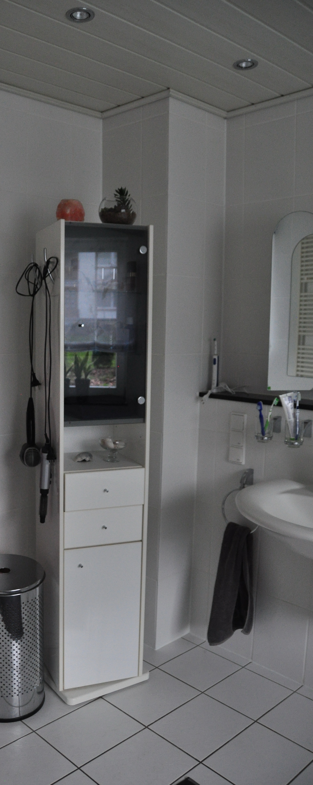
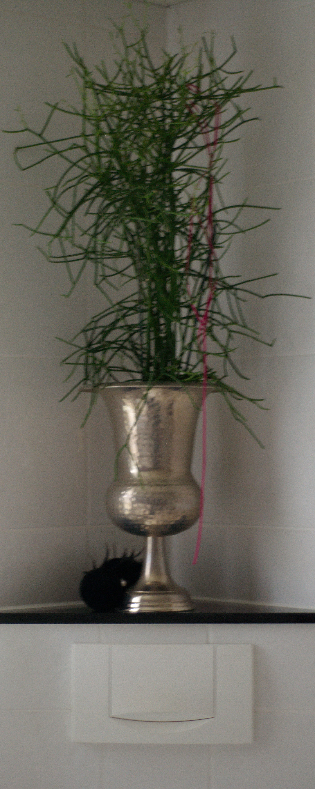
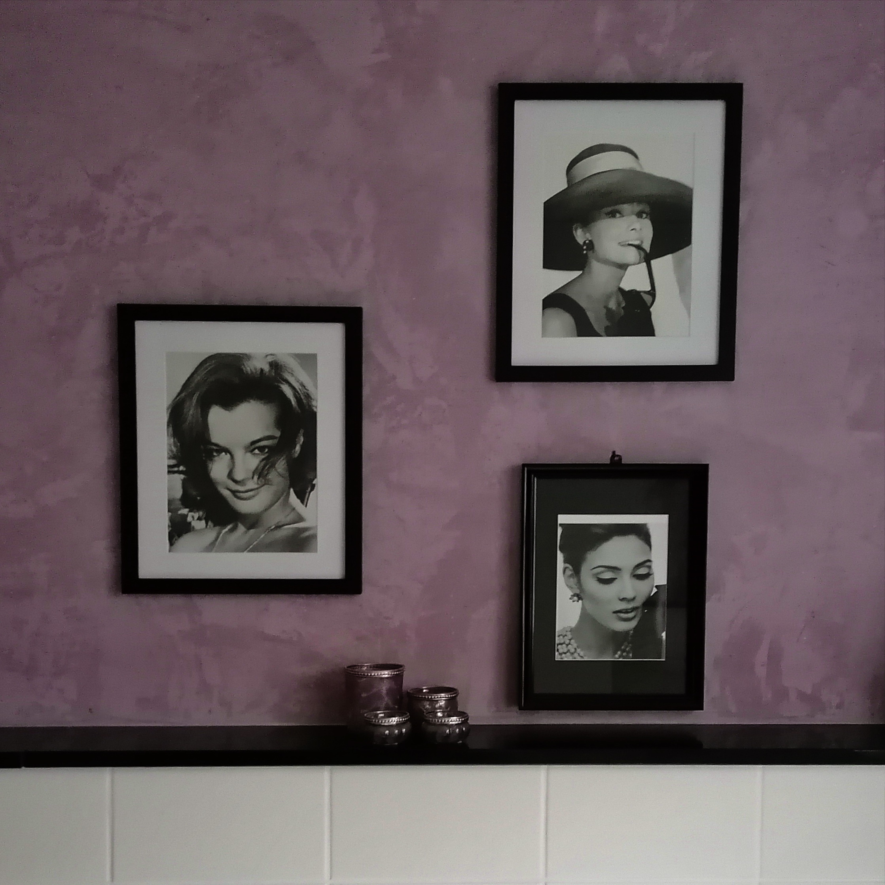
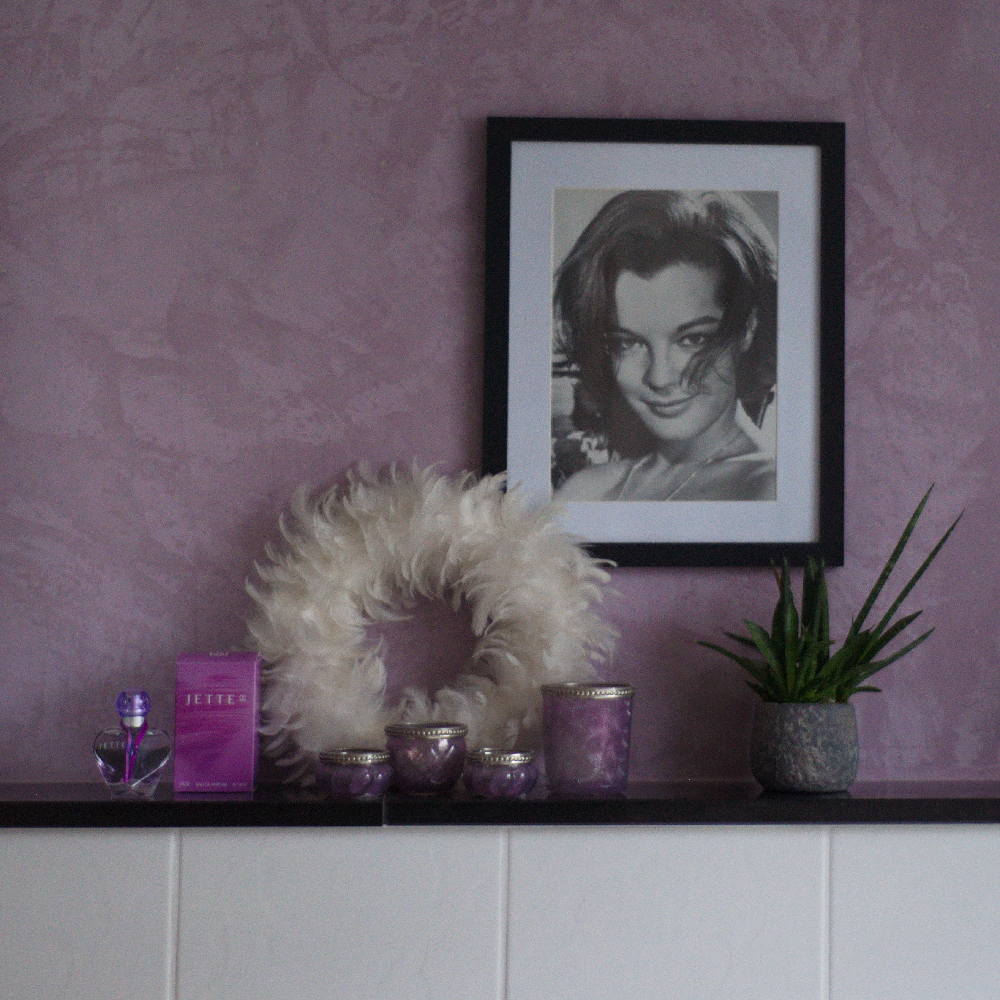
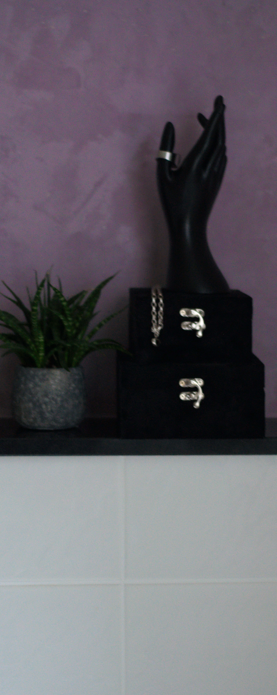
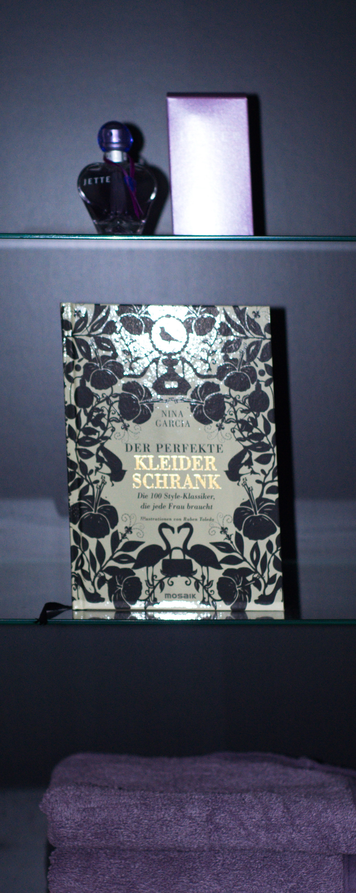
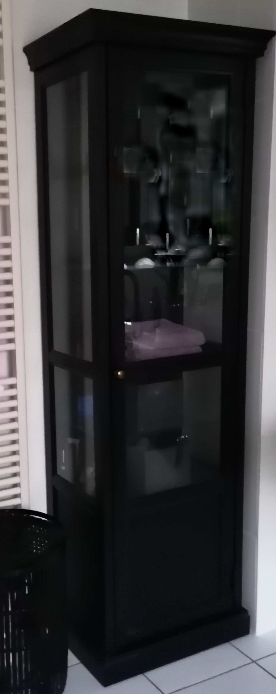
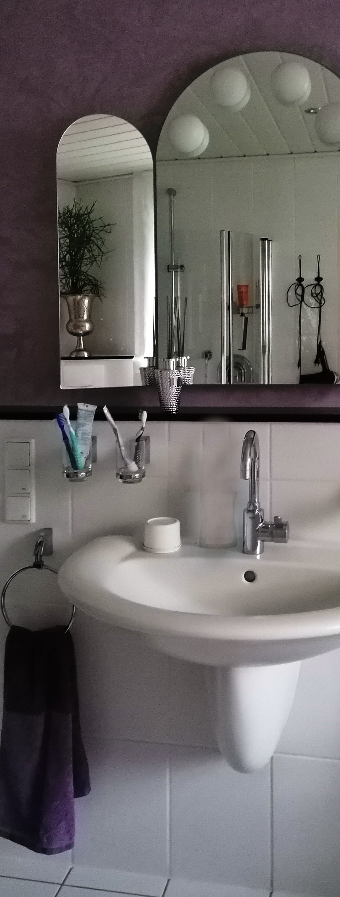
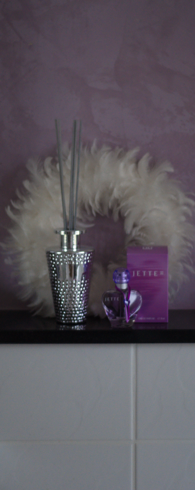
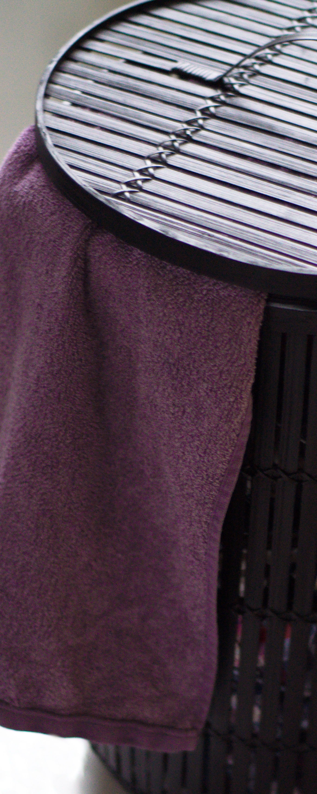

Die Aufgabe:  
Aufhübschen eines in die Jahre gekommenen weißen Badezimmers.
Mit geringem Arbeitsaufwand und kleinem Budget soll das Bad in Höxter einfach "anders" werden.  
 
Die Idee:  
Eine ausdrucksstarke Vitrine betont den Schwarz-Weiß-Kontrast, stellt schöne Accessoires zur Schau und
nimmt alles
"Nützliche" in Kisten und hinter Türen auf. Die Spachtelmasse aus Muschelkalk, mit der die Fliesen
oberhalb der Ablage
überzogen wurden, gleicht Feuchtigkeit im Raum aus und bringt mit der Farbe "Flieder" einen feinen
Look.
Ein Hauch von Glamour:
Stil-Ikonen der 1950er-Jahre, herrschaftlich gerahmt, Schmuckkästchen aus Samt, eine silberne Amphore,
florale Skulpturen,
ein schwerer Satin-Vorhang, edle Bambus-Wäschekörbe,
Kerzen, Ipuro, Fotos und Erinnerungsstücke machen die Nasszelle zum ganz persönlichen Spa!

