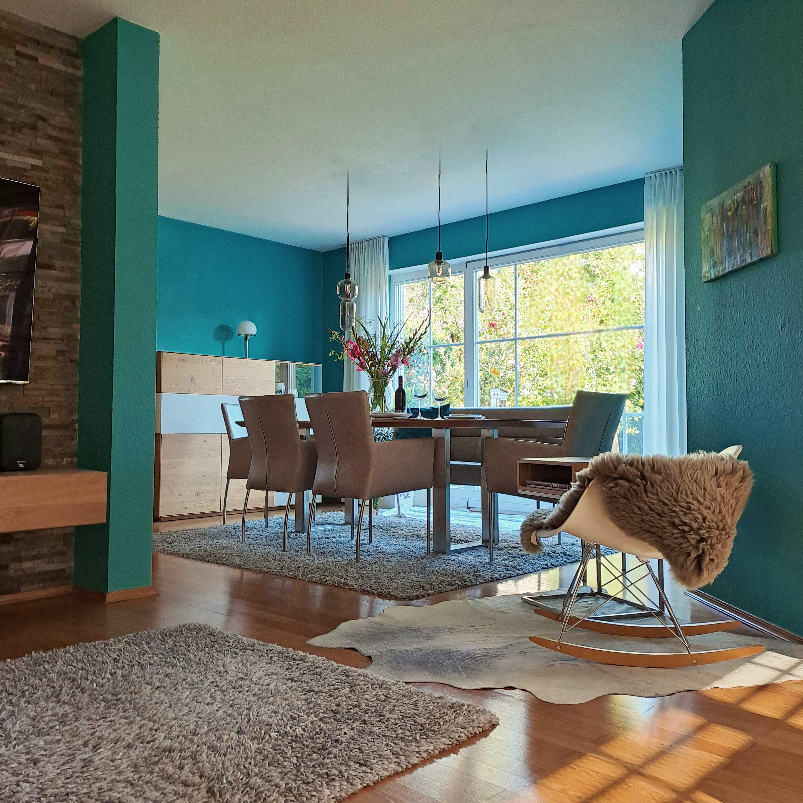

So kann es aussehen, wenn ein Wohn-Esszimmer einer kräftigen Frischekur unterzogen wird. Die dunklen, mit Schnitzerei verzierten Nussbaum-Möbel aus den 1970er-Jahren wichen klaren Linien und hochwertigen Materialien. Oma freut sich über einen großen Esstisch mit Lederstühlen und -bank für die Familie, Opa über einen komfortablen Bildschirm für Fussball-Abende mit Freunden.

