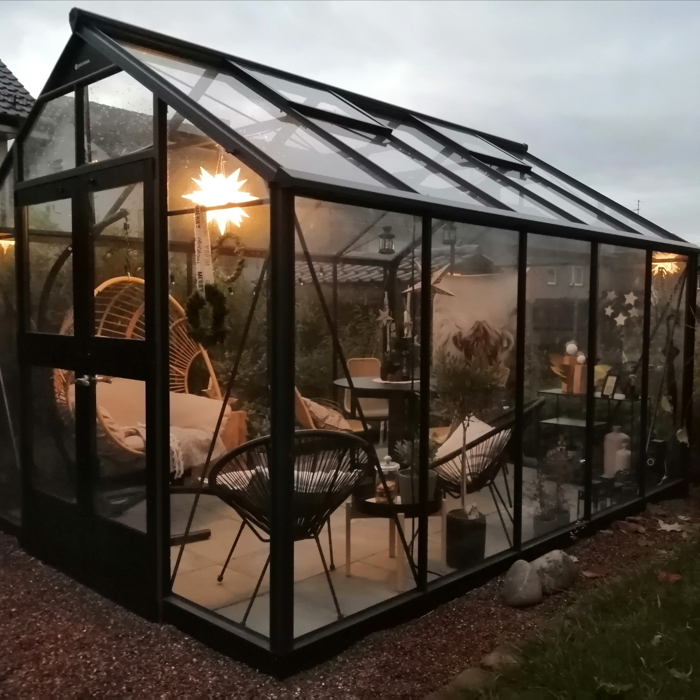
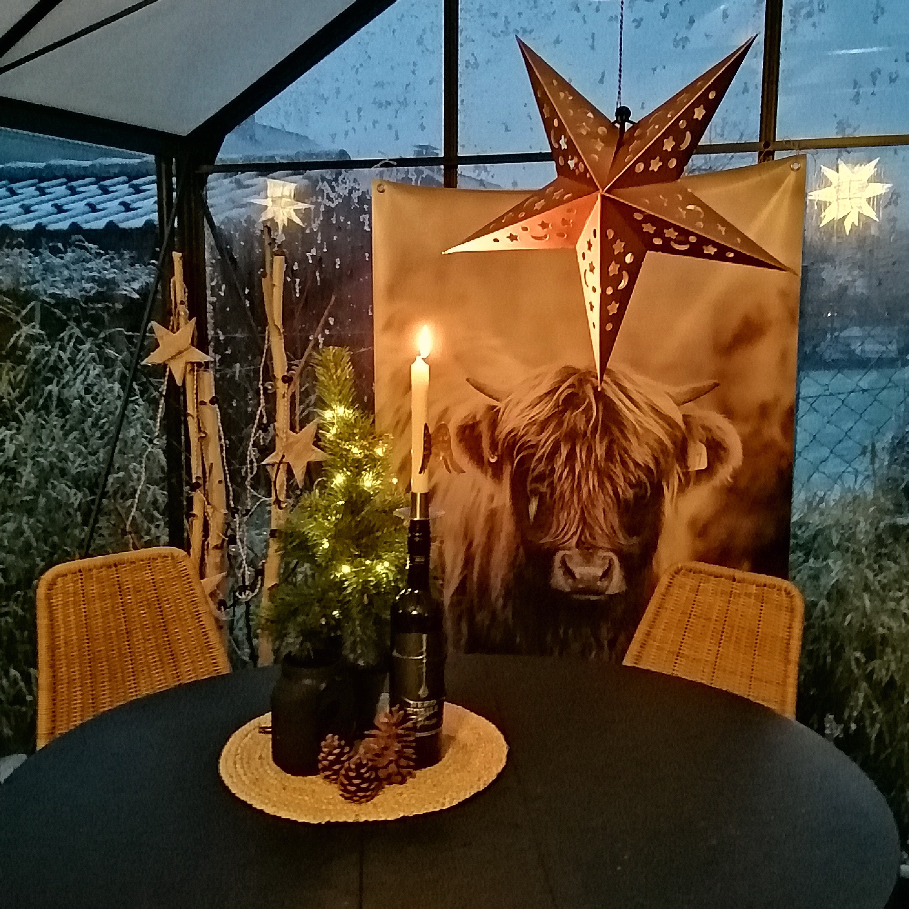
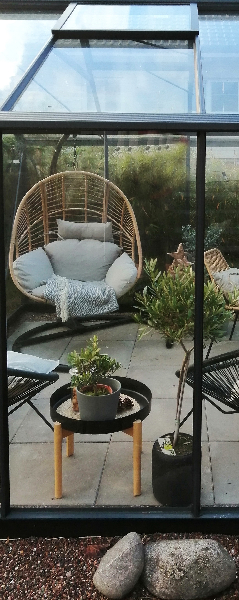
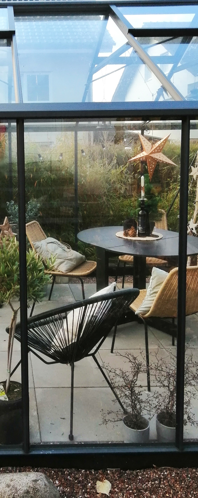

Der radikale Abriss von Teilen eines leerstehenden Holzlagers machte Platz für dieses dänische Gewächshaus, für einen Wintergarten der besonderen Art. Gemeinsam mit dem nun schwarz gestrichenen Schuppen, der das gestapelte Holz wie ein Bild rahmt, wertet er nicht nur ästhetisch den Garten auf, sondern bietet auch eine Vielzahl neuer Nutzungsmöglichkeiten.

