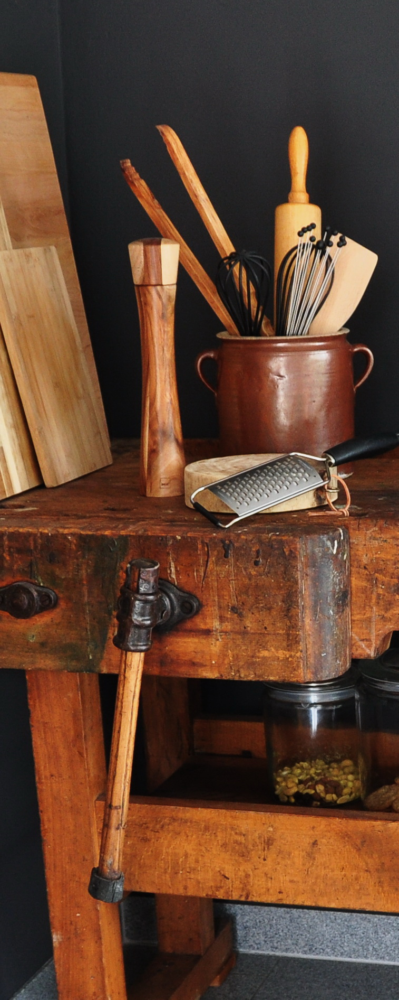
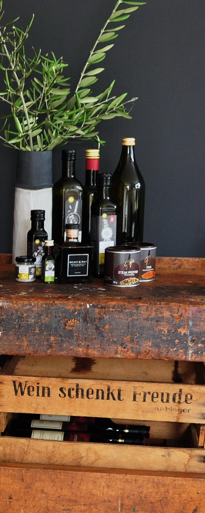
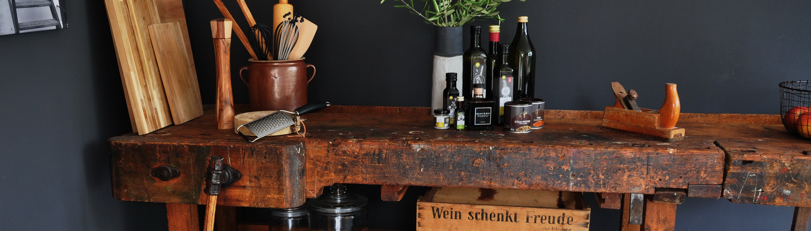

HOMESTORY  
 
Die Aufgabe:
 Integration einer fast 100 Jahre alten Hobelbank in ein modernes Wohnhaus. Seit vielen Jahren
steht sie verstaubt und fast vergessen im Abstellraum seiner Eltern. Thorsten möchte sie, wie auch
immer, zu neuem Leben erwecken. Im eigenen Werkzeugkeller wird repariert, nicht gefertigt. Wohin also
mit dem guten Stück?
 
 Die Idee:
 Eine Werkbank gehört dahin, wo gewerkelt wird - in die Küche! Die Spuren des bisherigen Lebens
sichtbar erhalten, hat ein Tischler ihre Oberfläche lebensmitteltauglich aufbereitet. Wo einst der
Urgroßvater Kirchenbänke mit dem Hobel bearbeitete, wird heute Käse und Gemüse gehobelt. Auf
Küchenparties dient das Erbstück als Ablagefläche für das Buffet. Das Anthrazit der Wand verleiht ihm
das notwendige Gewicht. Eine antike Arbeitsleuchte zur Wandmontage (Kaiser Idell, Mod. 6718,
Scherengelenk) wird hoffentlich kurzfristig bei ebay ersteigert. Der Stilbruch tut dem Raum gut,
erzeugt Spannung, und Geschichte bleibt lebendig!

