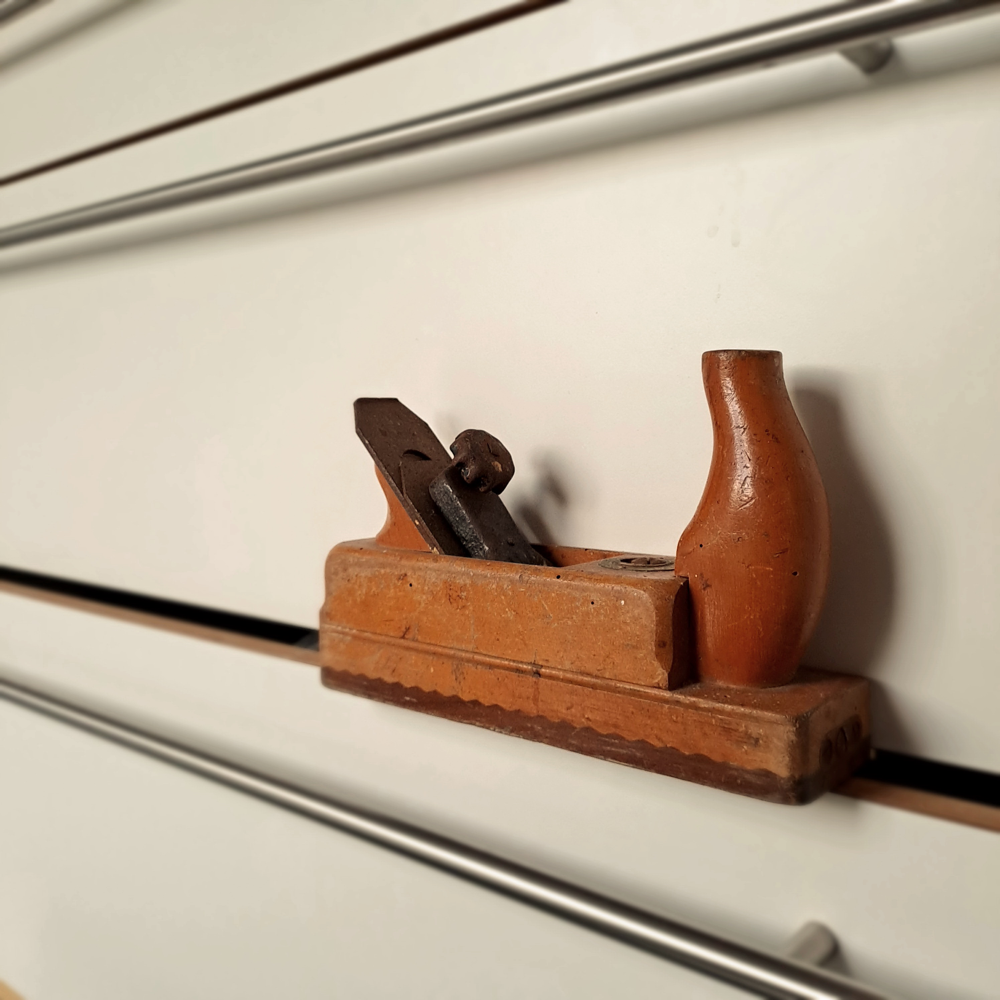
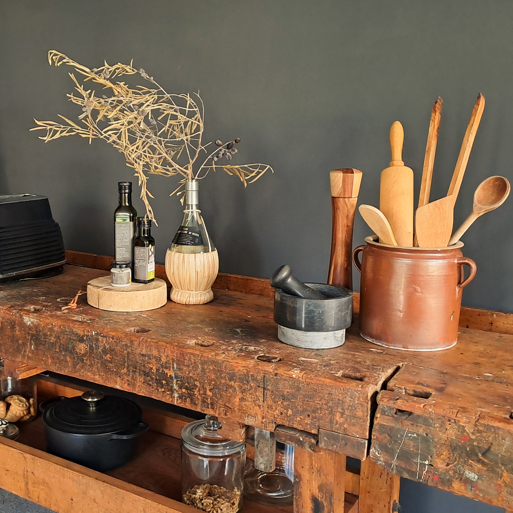
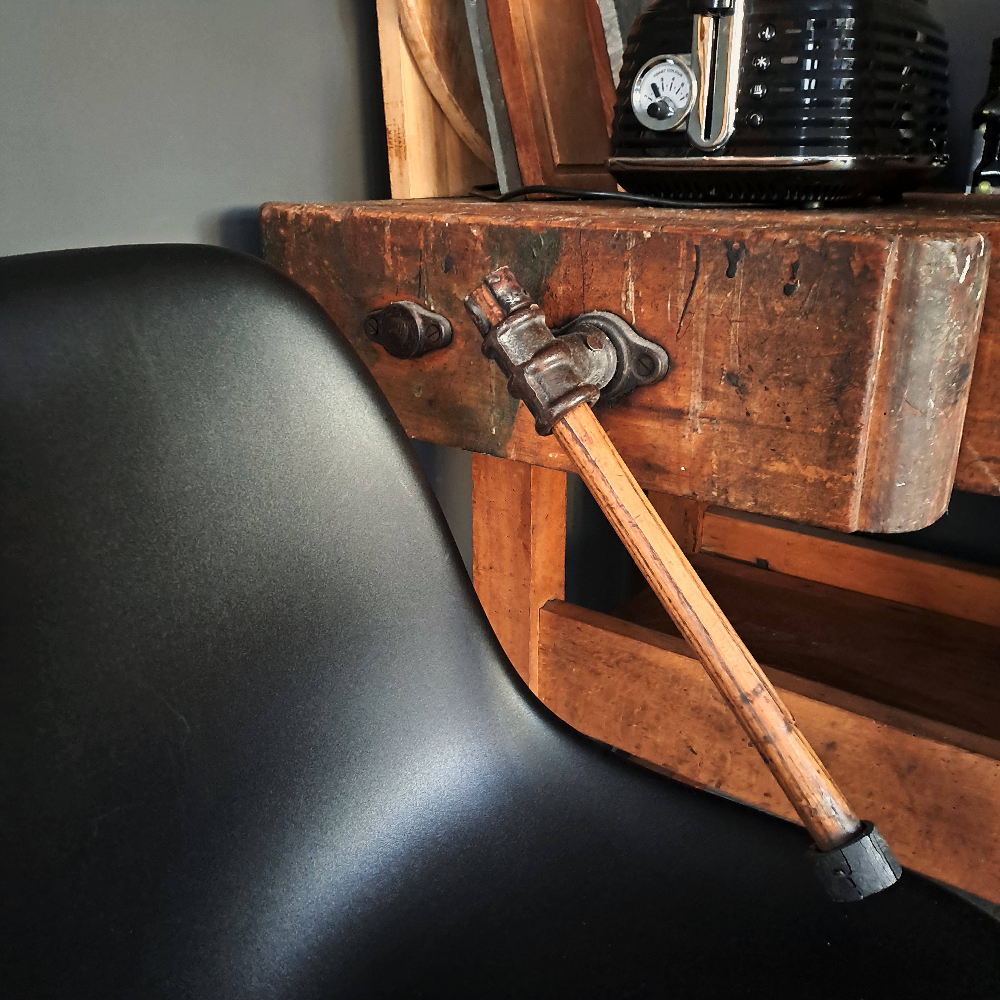
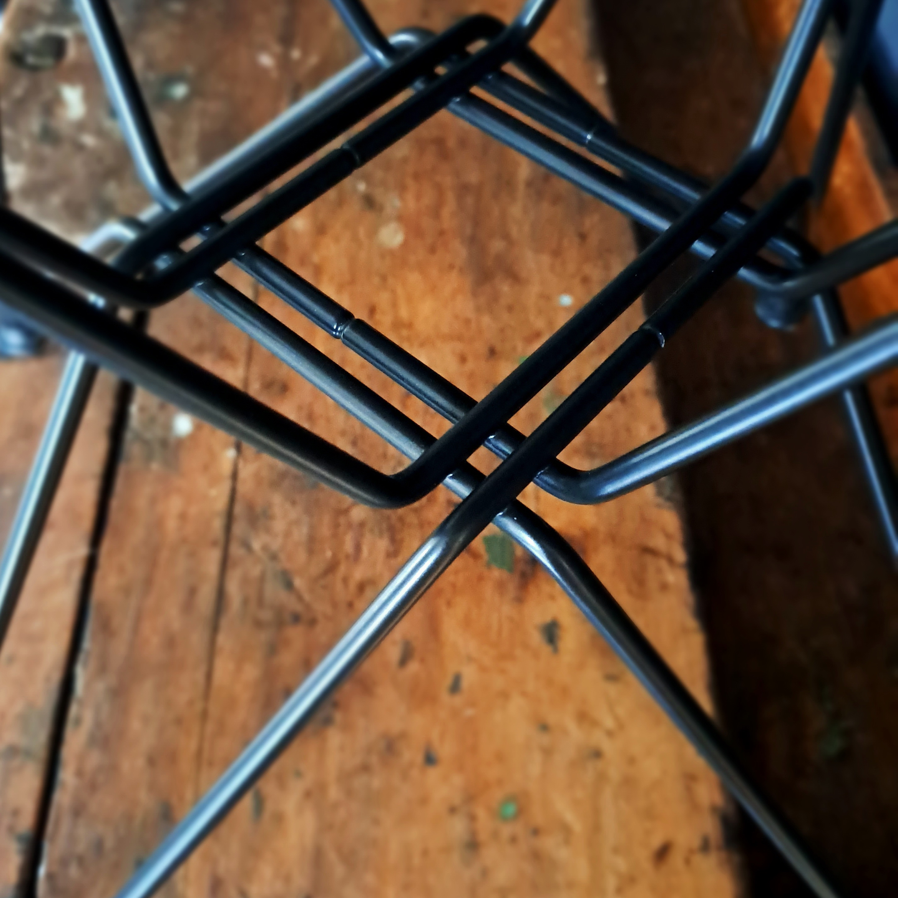
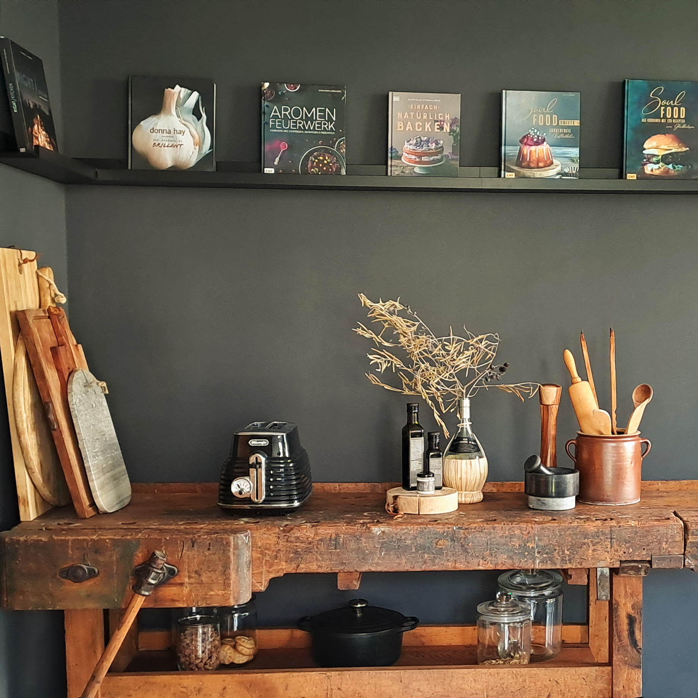
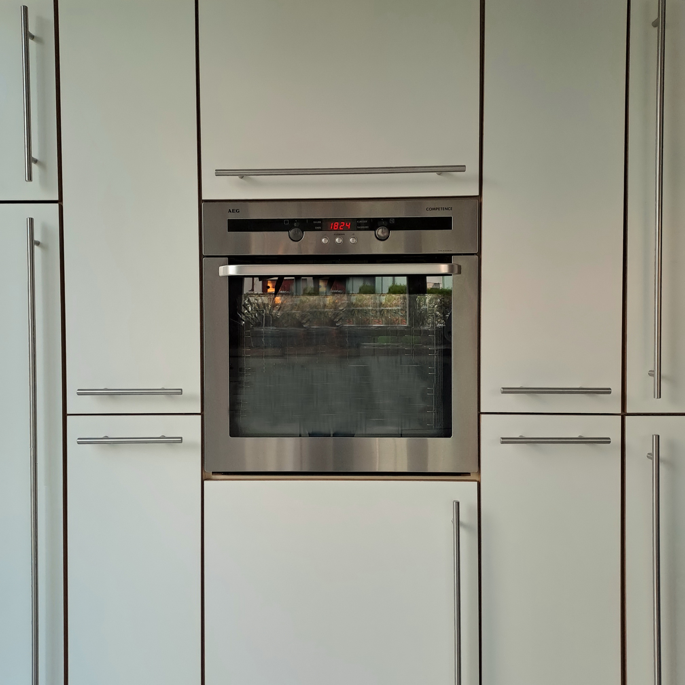

Unbeachtet, verstaubt & viele Jahre im Keller vergessen, wurde das Erbstück von Uropa Josef in der modernen Küche zu neuem Leben erweckt. Lebensmitteltauglich aufbereitet werden heute an der alten Werkbank Gemüse & Käse gehobelt, wo einst Kirchenbänke für St. Michael entstanden.

