Einrichten ist... sehen. fühlen. erleben. Dieser Maxime folgend sind die Büroräume der Holzhandel Lauenförde GmbH als eine Komposition aus Formen, Farben, Materialien, Düfte & Melodien des Waldes gestaltet. Mitarbeiter & Kunden können so den Unternehmensgegenstand "Holz" mit allen Sinnen erleben.

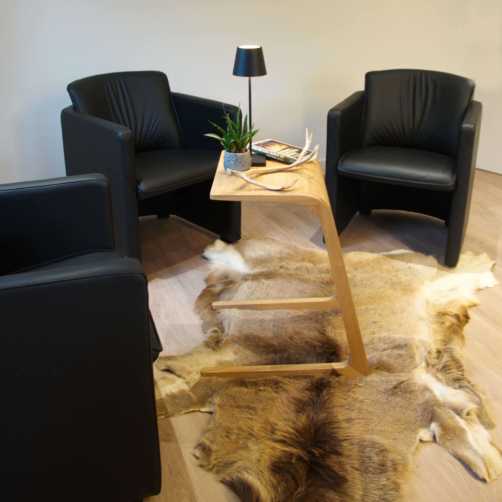

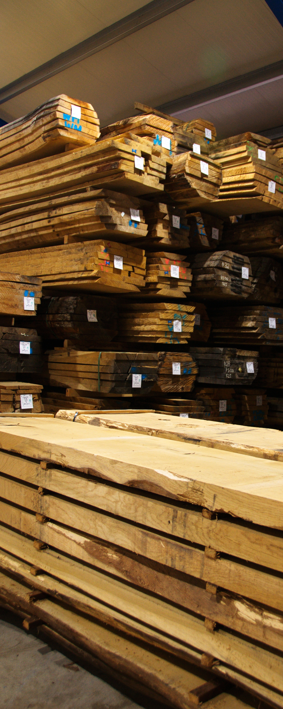
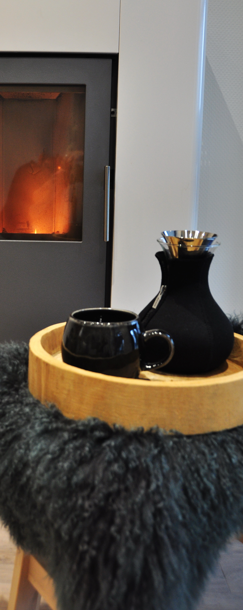
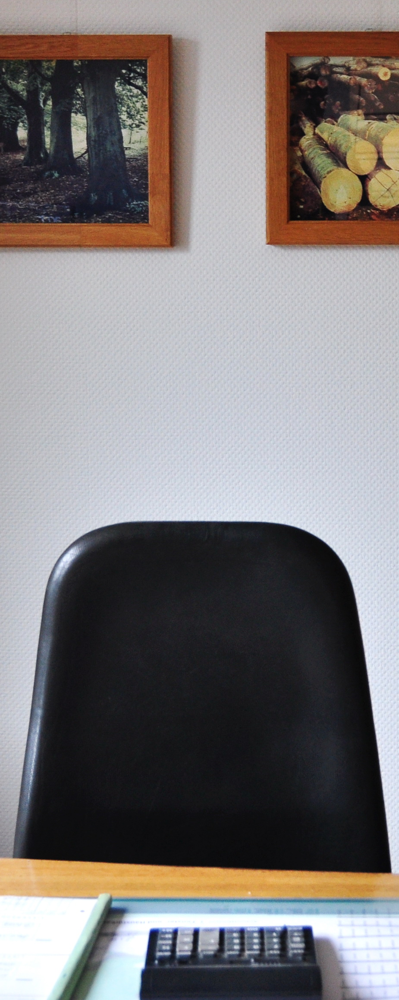
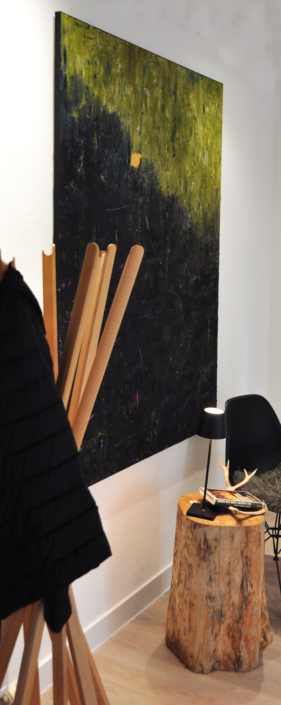

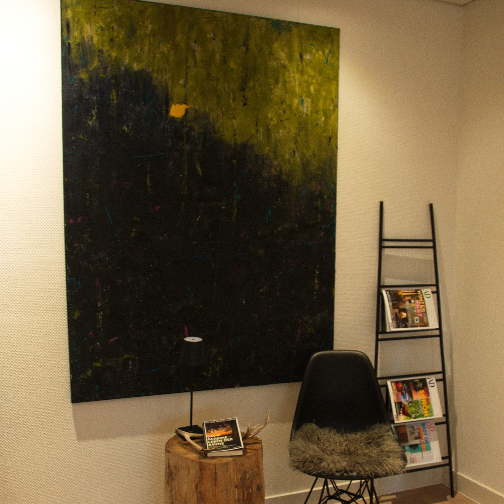

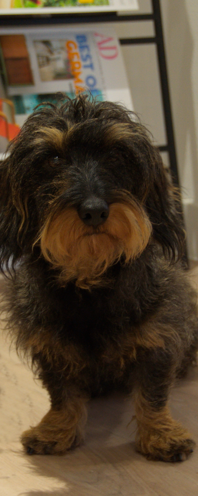
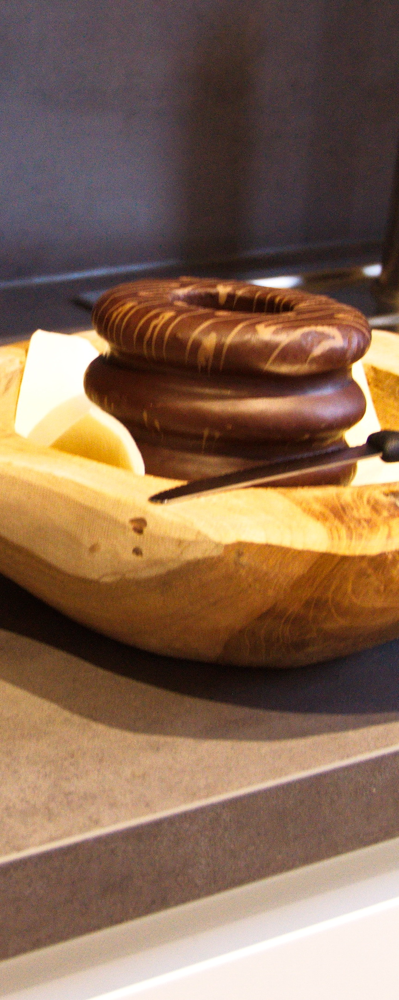

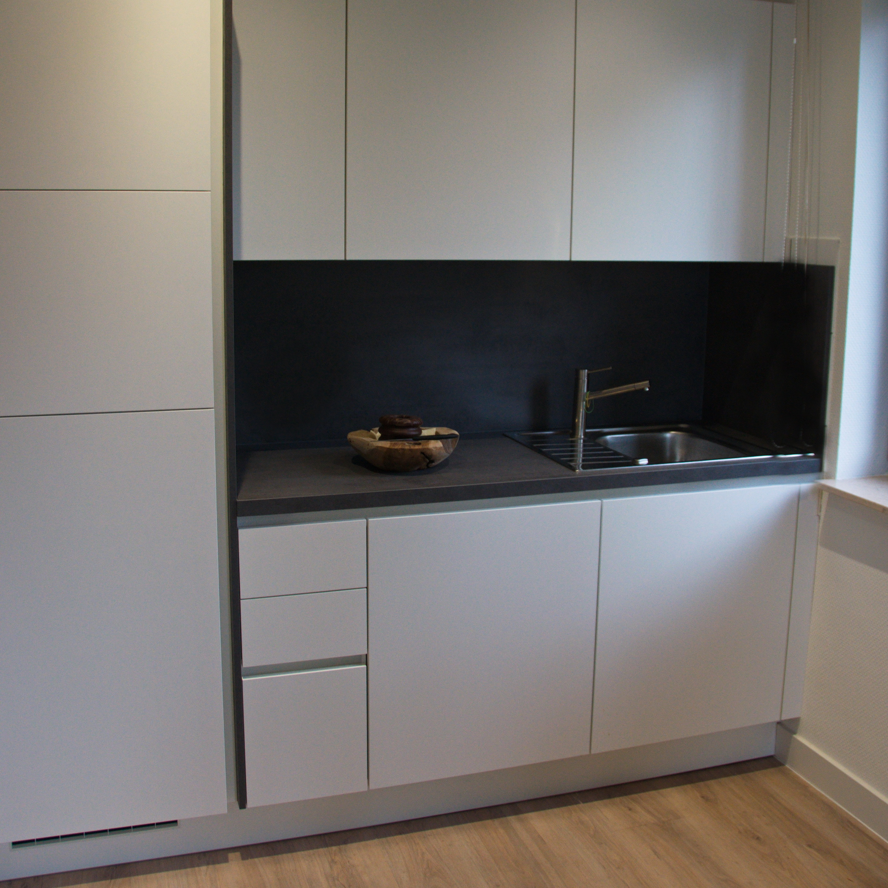

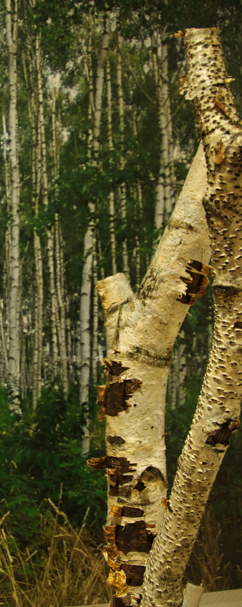
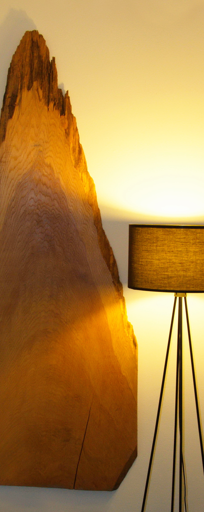

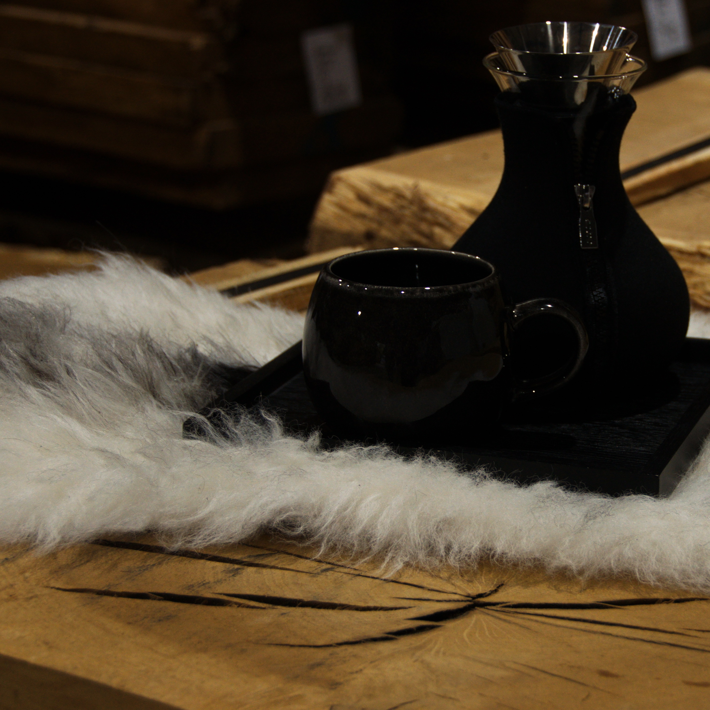
