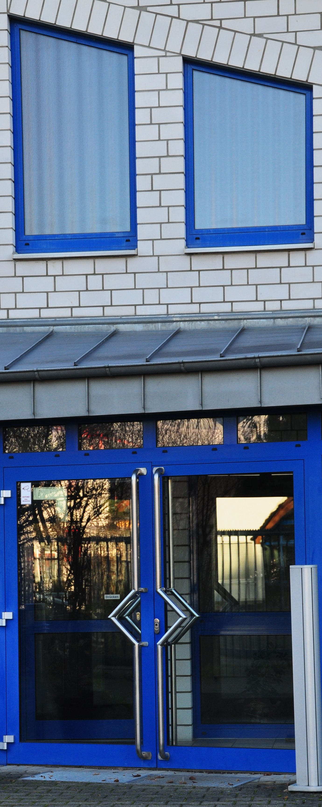

Die Aufgabe:
 Gestaltung neuer Büroräume der <a href="https://holzhl.com" target="_blank" style="color: white;">HolzHandel Lauenförde GmbH</a>. Die vormals von einem Sanitärbetrieb genutzten Räumlichkeiten tragen Kaltwasser-Blau & heißes Rot an Türen & Fenstern. Bodenfliesen, Lampen, Küche... sind in die Jahre gekommen. Auch, wenn die massiven Eiche- & Ahornmöbel aus dem vorigem Firmensitz ins neue "Zuhause" einziehen, wünschen sich MitarbeiterInnen ein modern, frisches Arbeitsumfeld.
 
Die Idee:  
"Holz", das Medium des Unternehmens, mit seiner warmen Farbe & der tollen Haptik, seinem einzigartigen Duft, soll sich auch in der Gestaltung der Räumlichkeiten wiederfinden. Ultramarinfarbene Türzargen & Heizkörper werden in zartem Sandton lackiert, weiß-rote Fliesen mit widerstandsfähigem Vinyl "Eichendiele" überdeckt.
Im Entrée empfängt ein wärmender Pellet-Ofen, Bänke & Stühle mit Fell & Holzklotz als Tisch. Ein wohnliches Bild. Lektüre zum Thema Natur. Garderobenständer "Sciangai".
Die Länge des Flures, von dem alle Büros zu erschließen sind, wird durch Holzhocker, vor allem jedoch durch ein großes Foto eines Birkenwaldes durchbrochen. Vor ihm platzierte, echte Birkenstämme suggerieren Dreidimensionalität.

Als skulpturales Wandobjekt brilliert eine massive Holzplanke - ein Schmuckstück, das ganz allein für sich wirkt und nur mit etwas Licht zufrieden ist. Energiesparende Leuchten auf der Kommode illuminieren, auch wenn die großen Strahler ausgeschaltet sind. Große & kleine Teakholzschalen verschönern & versüßen den Arbeitsalltag.
Modernität zieht durch schwarze, schmale Schreibtischleuchten in die Büros ein.
Überall sind Bilderschienen zu finden, an denen Fotoleinwände & gerahmte Erinnerungen nach Laune & Jahreszeit gewechselt werden können - Holzpolter, Rückepferde, Herbstlaub... der Wald liefert unzählige, tolle Motive!
Beim Geschäftsführer nehmen Kunden & Kollegen in bequemen Ledersesseln auf einem Rentierfell platz. Der gebogene Laptoptisch aus heimischer Eiche ermöglicht, neben der Schreibtischarbeit, die Arbeitsposition zu wechseln, nimmt aber auch Getränke der Gäste auf. Schlichtes Understatement. Und eine entspannte Atmosphäre für gute Gespräche.
Das Anthrazit & Weiß der geradlinigen Küche harmoniert perfekt mit dem Echtholz-Tisch der alten Teeküche. Leichte Stühle aus schwarz lackiertem Metall verbreiten skandinavischen Chic & eine schwarze Hängeleuchte in Röhrenform über dem Tisch erinnert an einen Baumstamm. Kleine Momente der Auszeit genießt man hier nun gern bei Kaffee, Tee & Baumkuchen... Immer dabei - Hund Edda.

