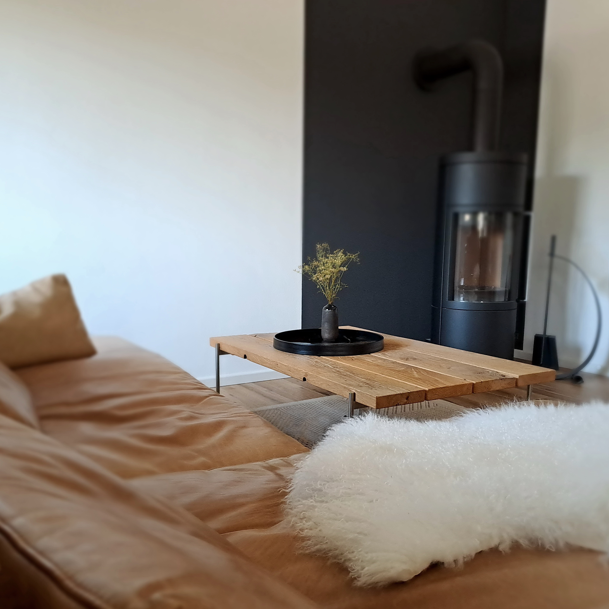
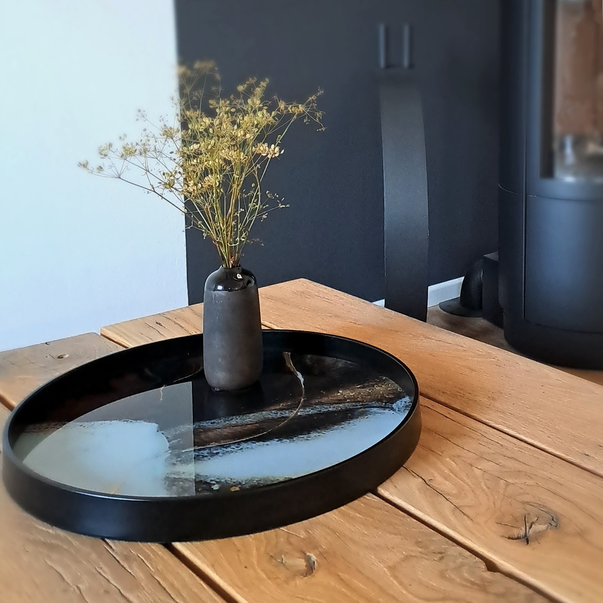
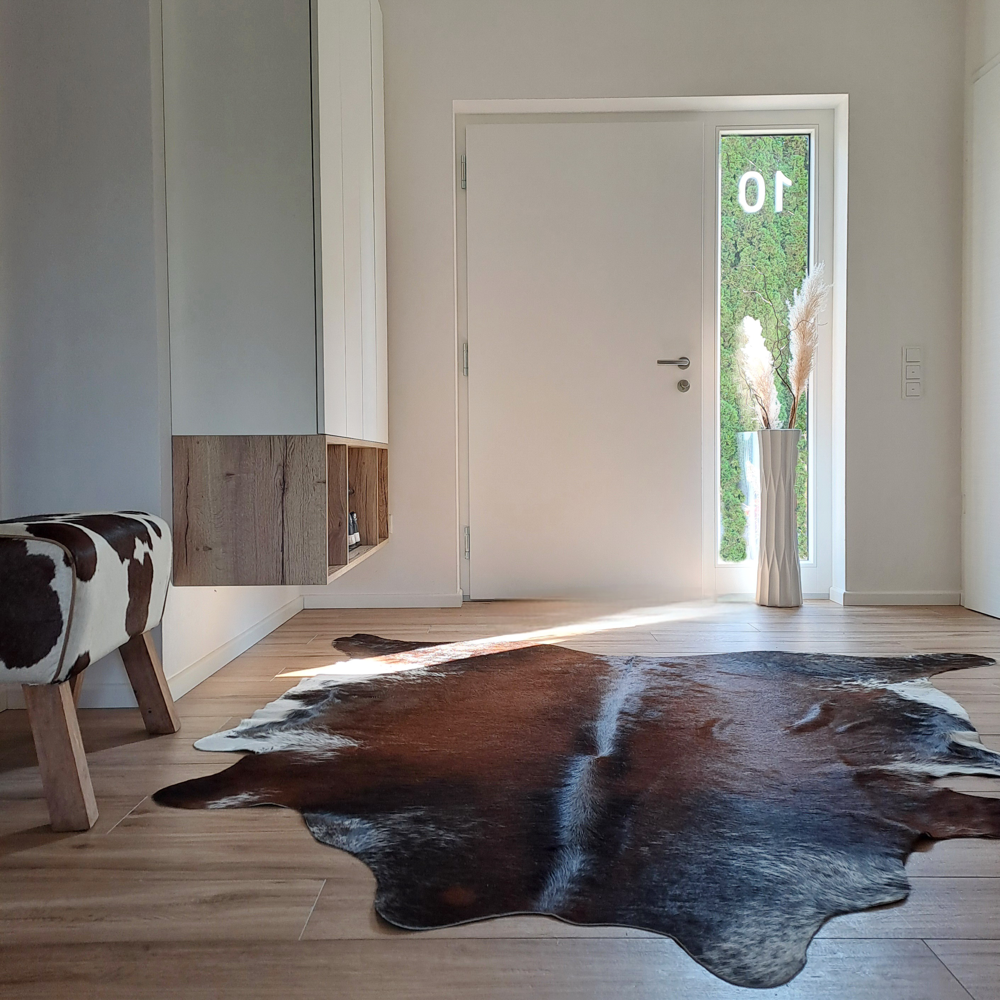
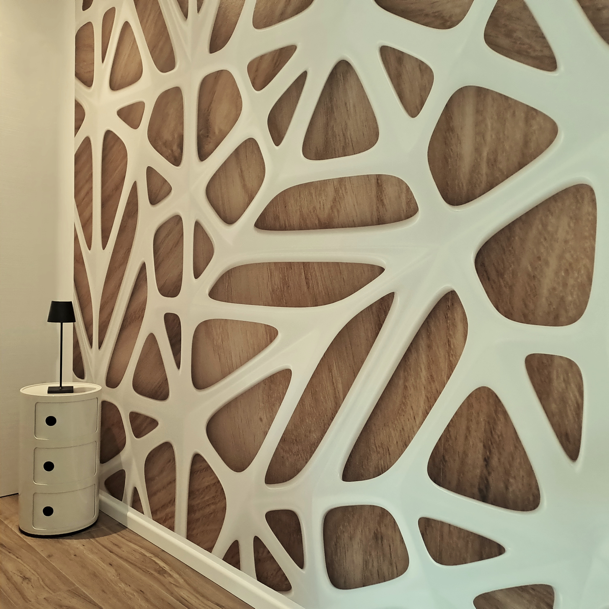
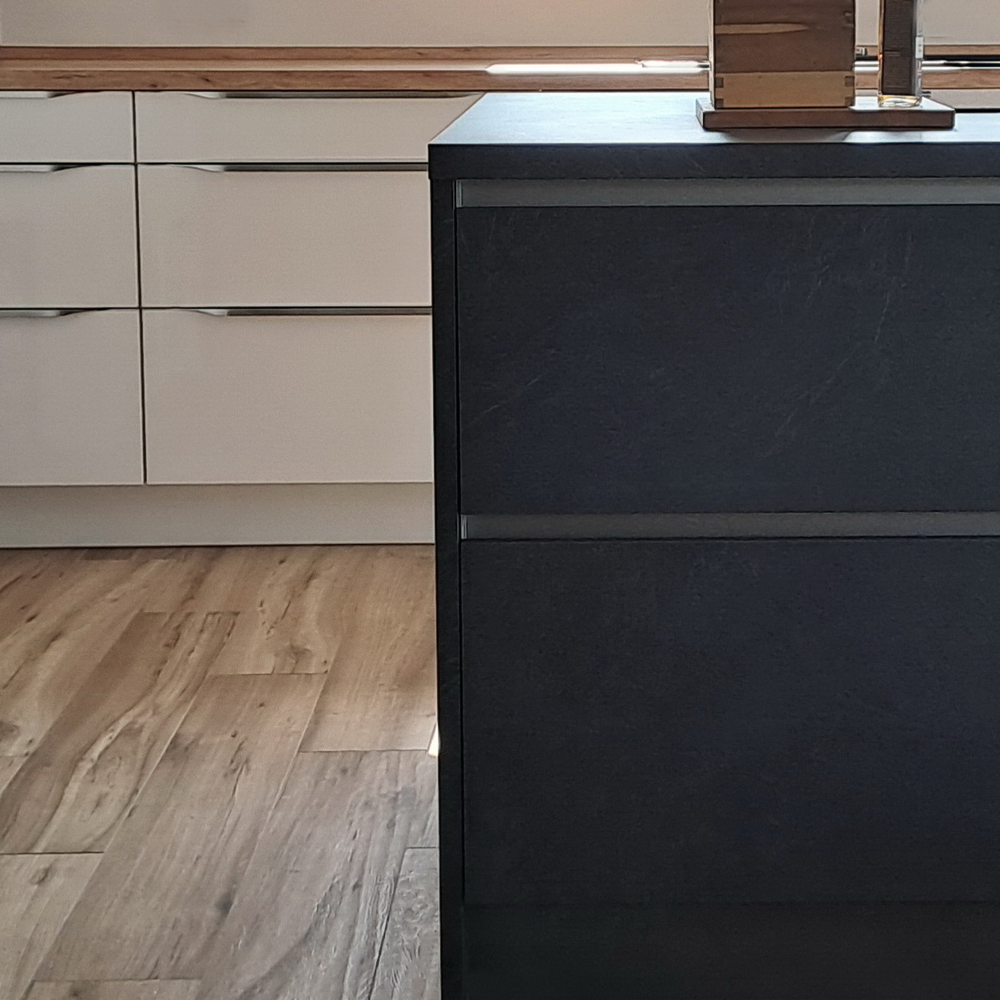
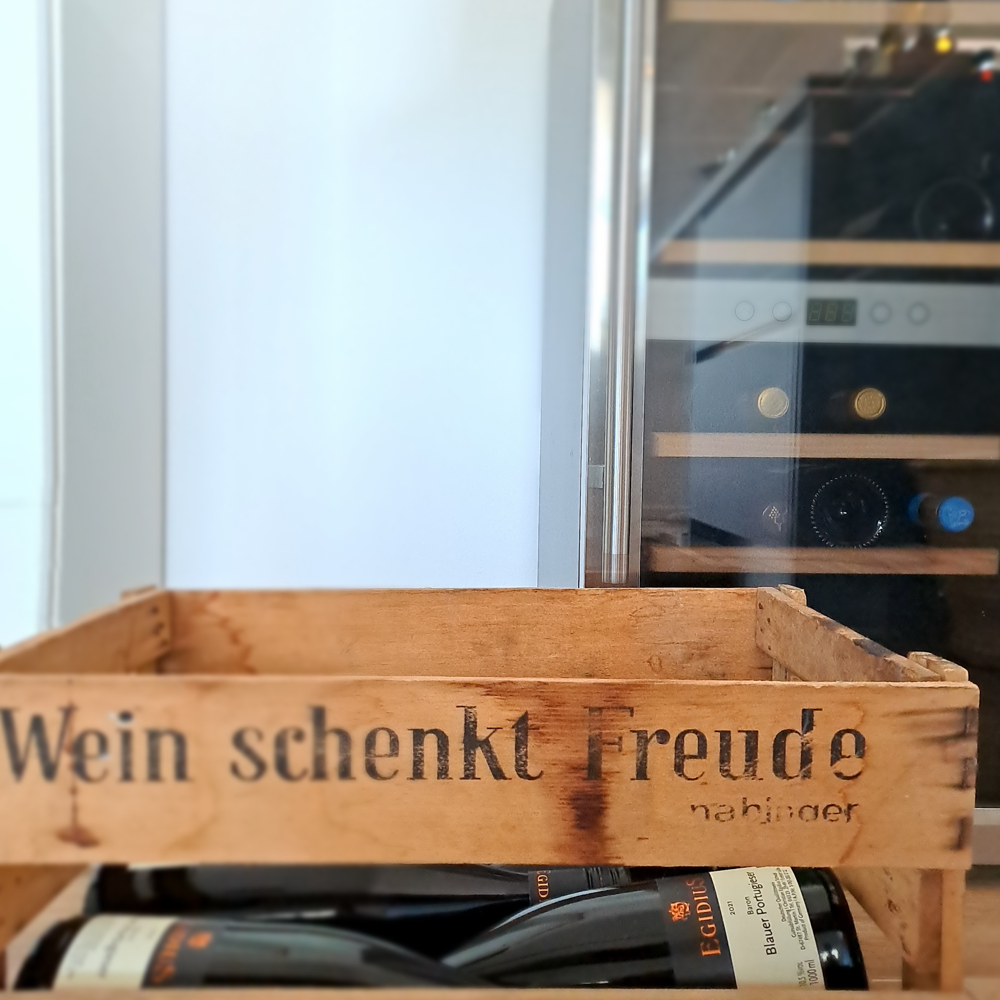
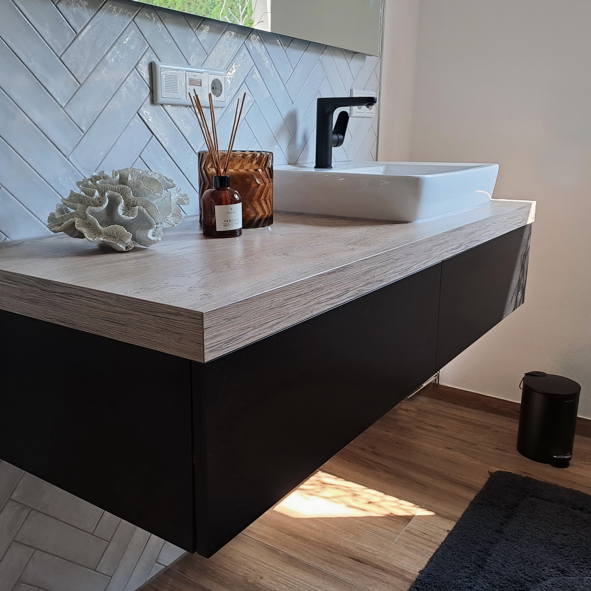
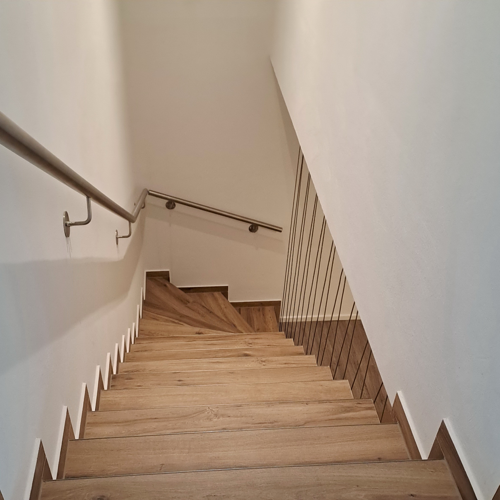
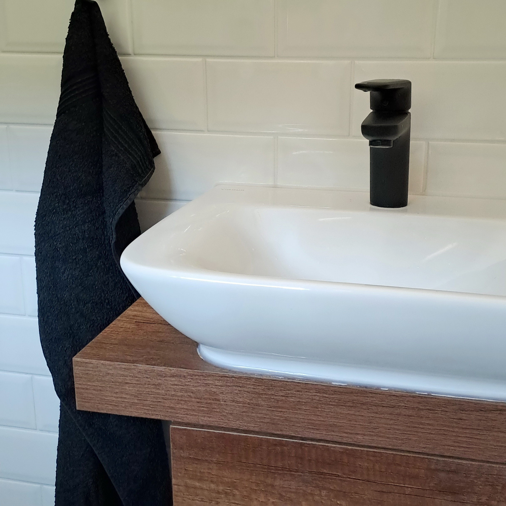
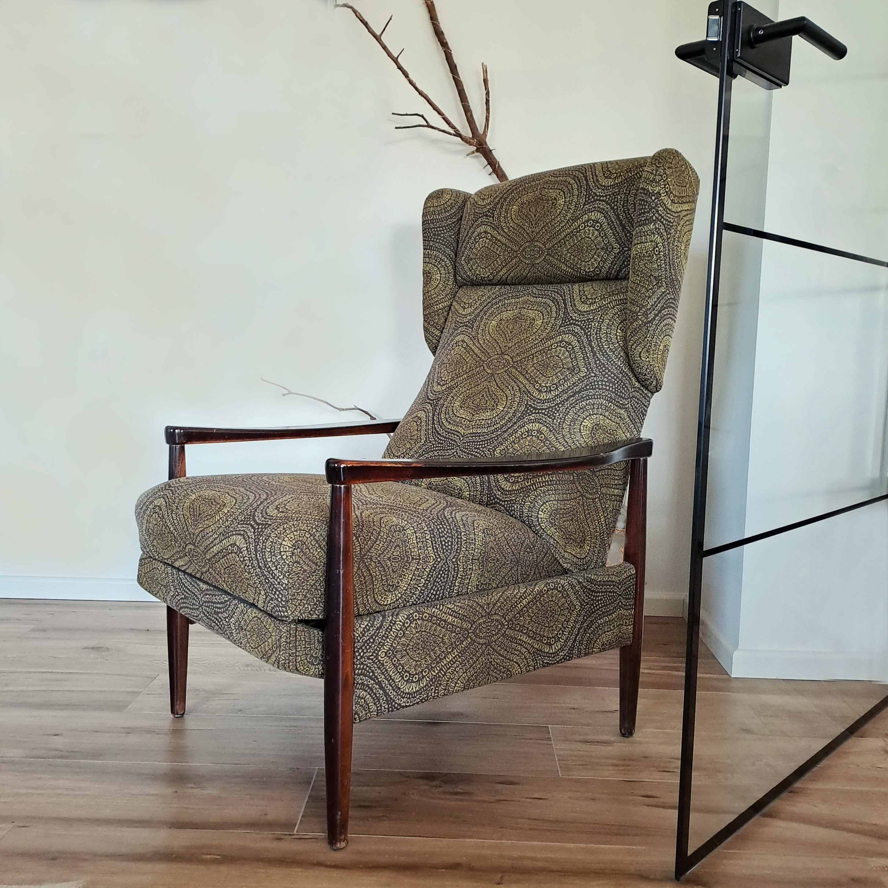

Die Innenausstattung dieses Neubaus sollte eine moderne Gemütlichkeit ausstrahlen, pflegeleicht & altersgerecht/alterstauglich sein. Die offene Wohnküche mit hohem Luftraum über Ess- und Wohnzimmer wirkt dank warmer Farben, natürlicher Materialien & der Integration vorhandener Lieblingsstücke luftig leicht. Nicht nur Nala liebt's.

