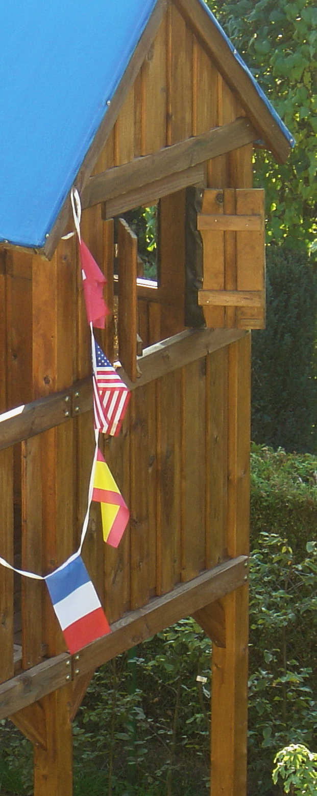
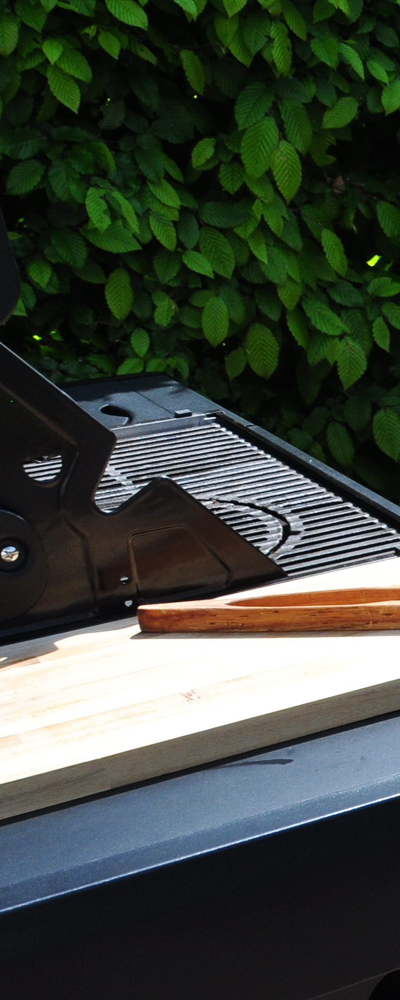
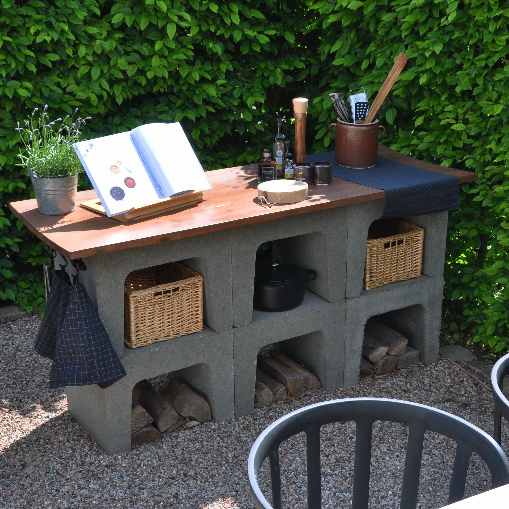
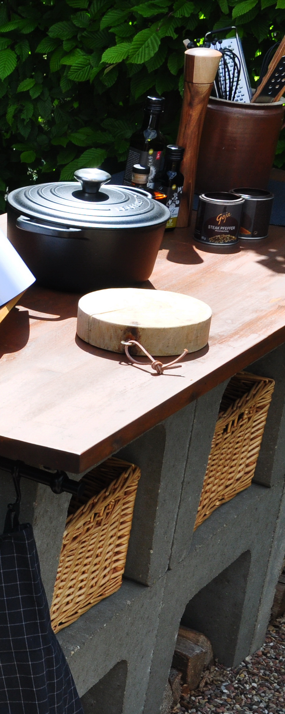
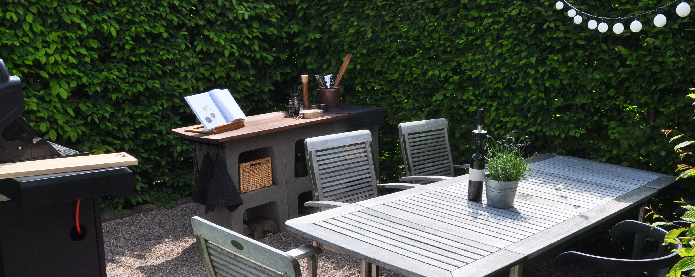

HOMESTORY  
 
Die Aufgabe:
 Umnutzung einer von Buchenhecke gerahmten Gartenecke. Das Kletterhaus aus Kindertagen hat
ausgedient. Die Familie wünscht sich einen Platz für schöne, gemeinsame Stunden.
 
 Die Idee:
 Heimischer Wesersandstein fasst den Ort ein, Weserkies schafft Biergarten-Atmosphäre. Aus
Beton-U-Profilen & einer Akazienküchenarbeitsplatte wird einfach, aber wirkungsvoll eine Outdoorküche
installiert. Neben einem großen Grill mit Seitenbrenner kann ebenfalls auf zwei Induktionsplatten
gekocht werden. Moritz und Jette backen nun anstatt Sandkuchen im Kletterhaus leckere Variationen auf
dem Pizzastein. Besonders abends wird es am großen Teak-Esstisch nebenan gemütlich und unter der
Solar-Lichterkette kann man bis spät in die Nacht hinein Karten spielen...

