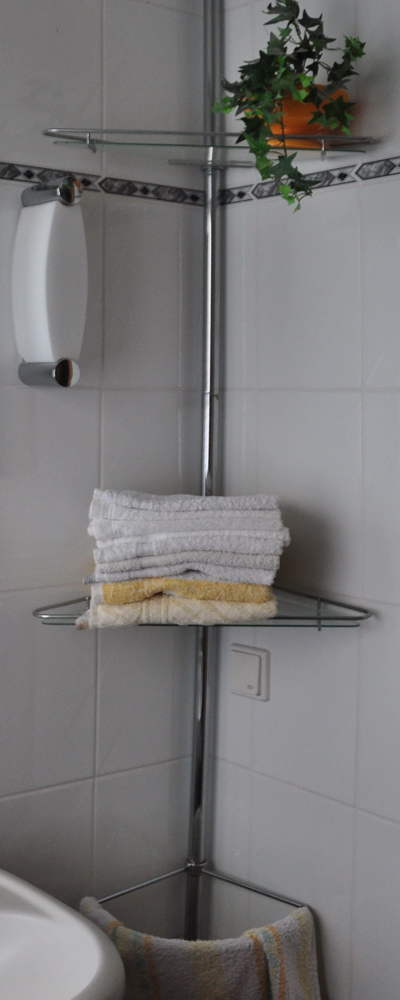
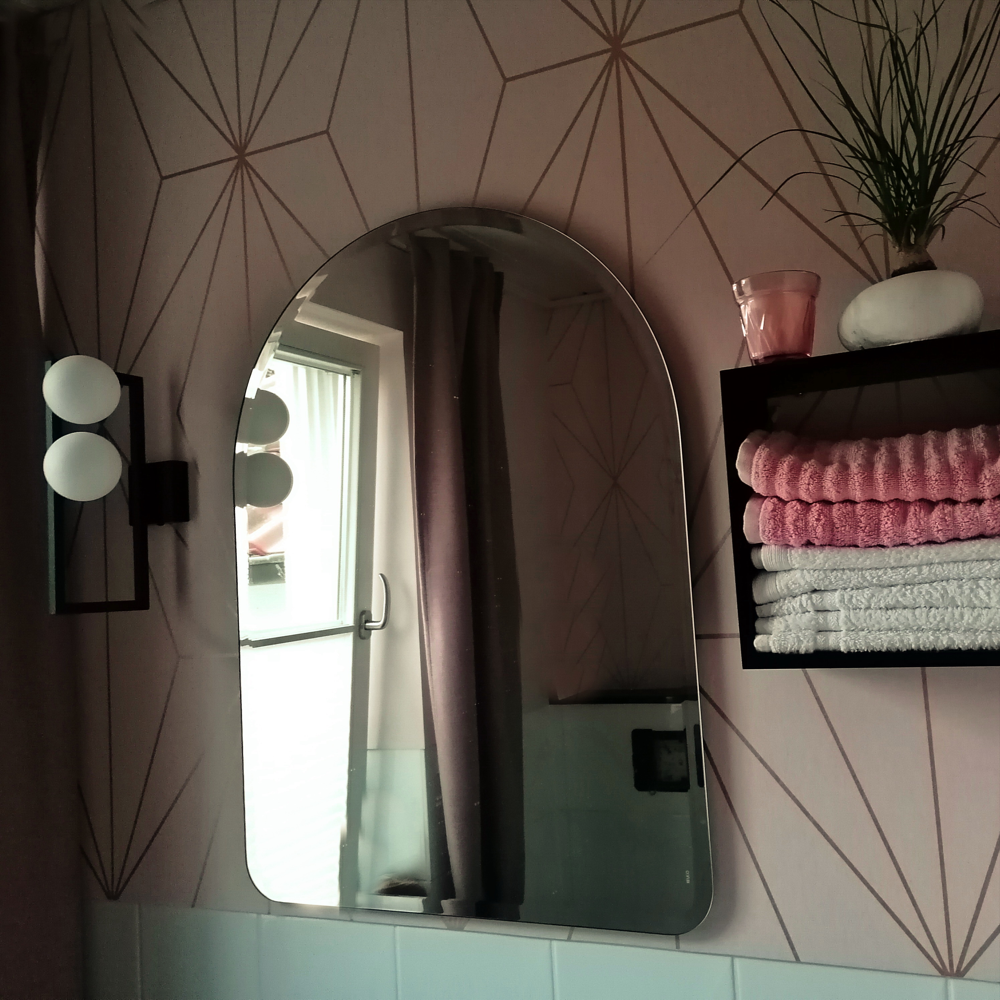
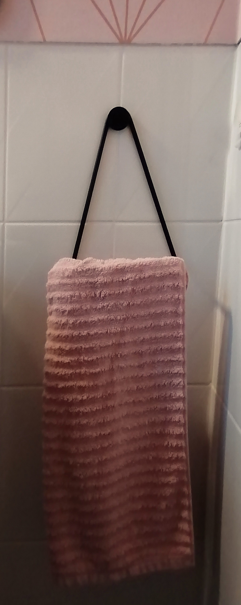
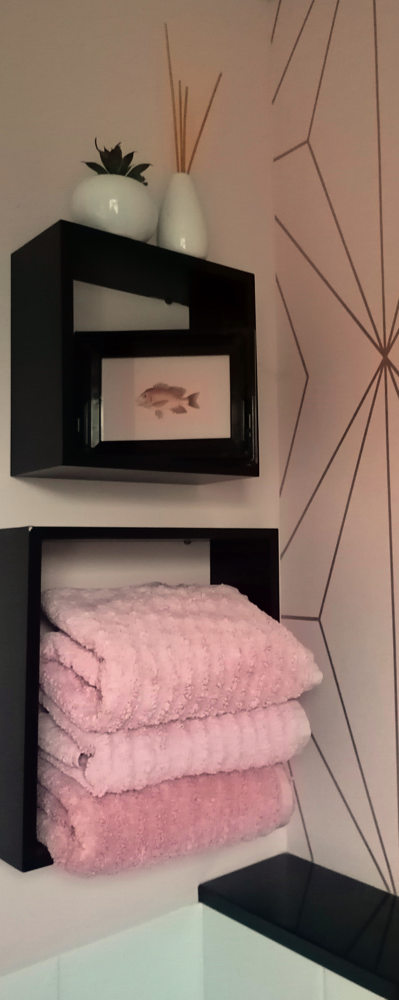
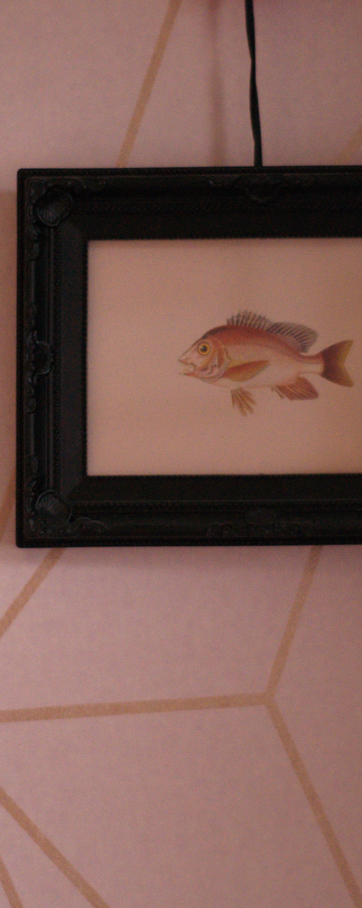
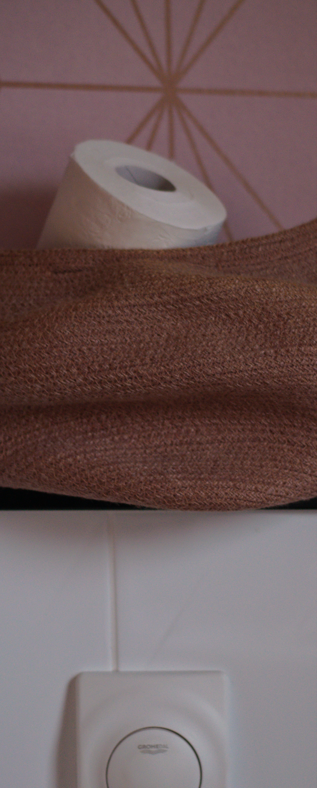
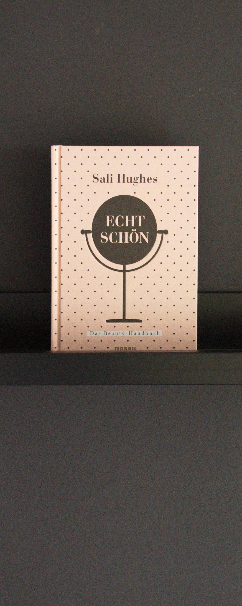

Die Aufgabe:  
Aufräumen im Gäste-WC:
Riemchenfliesen der 1990er-Jahre, Notlösungen, Staubfänger, Kühlhausatmosphäre -'raus. Clevere
Lösungen, praktische Details, Farbe, Wärme & Wohnlichkeit - 'rein!
Theresia wünscht sich mit vorhandenen, alten Badobjekten einen modernen Look.  
 
Die Idee:  
Der obere Teil der Fliesen wird gespachtelt und tapeziert. Zartes Rosa, roségoldene Ornamente
versprühen Stil.
Hygiene-Artikel verschwinden griffbereit im hübschen Korb. Das Schwarz von Fensterbank, Ablage und
Fußboden  
wird in modernen Accessoires wie Lampe, Handtuchhalter und Kubus-Regalen aufgegriffen. Weiche
Textilien und kesse Lektüre  
runden die Modernität ab.

